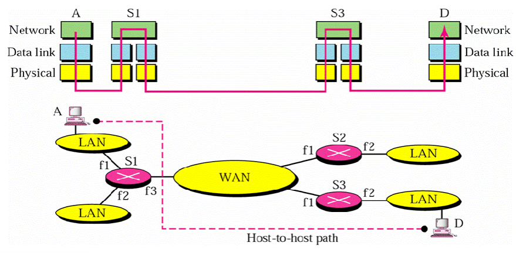
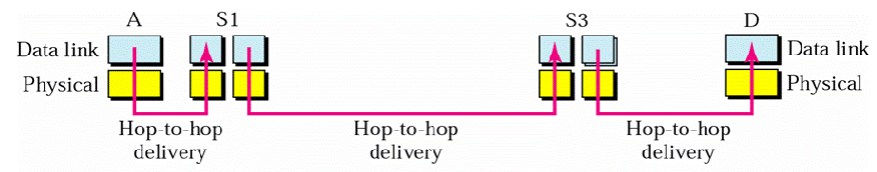
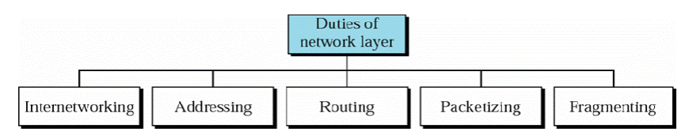
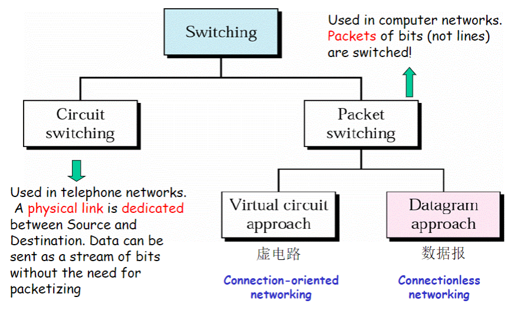
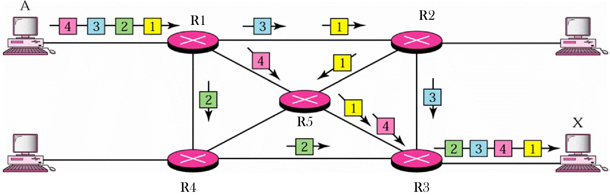

*请求出错: Expecting value: line 1 column 1 (char 0)*——*未知*

# Positions and Functions of Network Layer

`Network layer is the lowest layer that deals with endto-end (host-to-host) transmission (端到端传输)`

**端到端传输的最低位**

## Host-to-Host Delivery 主机-主机传输

与数据链路层的逐跳传输不同，网络层以主机为单位

## Network Duties

### 网络互联 Interconnecting

* 不同的网络：网络地址不同、实现技术可能不同、包格式可能不同  `Interconnecting different networks and making them look the same to the transport layer.`
* 网络的个数及其具体技术对于传输层透明 `The transport layer should not be worried about the underlying physical network ! `

### 编址 Addressing

* 统一的地址格式  `The addresses of a host/router must be uniquely and universally.  `
* 接口地址唯一  `Two devices on the internet can never have the same address. (Address per interface to network)`

### 路由选择 Routing

* 在网络中，当要将数据包发送到目的地址时，需要确定 “下一跳”
* 数据包自身没有智能去选择传输路径
  * 连接局域网（LANs）和广域网（WANs）的路由器承担起这个决策任务

### 打包 Packeting

网络层从上层接收封装好的消息，并将其组成数据包；由网际协议（IP）来完成

`Encapsulated message received from upper layer and forming packets, a task common to all layers. In Internet, packetizing is done by IP.`

### 分段/分片 Fragmenting

* 网络层必须能够在任何数据链路层技术之上运行 `The network layer must be able to operate on top of any data-link layer technology.`
* 各种数据链路层技术所能处理的数据包长度不同 `All these technologies can handle a different packet length.`
* 由于数据链路层可处理的数据包长度不同，网络层必须具备将传输层协议数据单元（PDU，Protocol Data Unit ）分割成更小单元的能力 `The network layer must be able to fragment transport layer PDUs into smaller units so that they can be transferred over various data-link layer technologies.`

## 三段式

### 源端网络层（Network Layer at the Source）

* **数据包创建** ：源端网络层接收来自其他协议的数据后，负责创建数据包 。
* **路由信息查询** ：源端网络层还会查询路由表 。通过查看路由表，获取诸如输出接口（如以太网、WiFi 等接口 ）等路由信息，为数据包规划从源端出发的传输路径

### **路由器网络层（Network Layer at the Router）**

当数据包从数据链路层到达路由器时，路由器会查询自身的路由表 。

路由器依据数据包的目的地址，通过路由表确定将数据包转发出去的接口，引导数据包朝着目的主机继续传输

### 目的端网络层（Network Layer at the Destination）

当数据包从数据链路层到达目的主机的网络层后，目的端会检查数据包上的目的地址是否与本主机地址一致 。

* 若一致，说明数据包成功到达目的地，后续可将数据传递给其他协议进行处理；
* 若不一致，则说明可能存在传输错误等问题。

# Services 服务设计

## 设计目标（Design Goal）

* 与路由器技术无关
* 屏蔽路由器细节
* 统一编址

## 交换 switching

## Implementation of Connectionless Service: Datagram(数据报) Network

