*请求出错: Expecting value: line 1 column 1 (char 0)*——*未知*

# Positions and Functions of Network Layer

`Network layer is the lowest layer that deals with endto-end (host-to-host) transmission (端到端传输)`

**端到端传输的最低位**

## Host-to-Host Delivery 主机-主机传输

与数据链路层的逐跳传输不同，网络层以主机为单位

## Network Duties

### 网络互联 Interconnecting

* 不同的网络：网络地址不同、实现技术可能不同、包格式可能不同  `Interconnecting different networks and making them look the same to the transport layer.`
* 网络的个数及其具体技术对于传输层透明 `The transport layer should not be worried about the underlying physical network ! `

### 编址 Addressing

* 统一的地址格式  `The addresses of a host/router must be uniquely and universally.  `
* 接口地址唯一  `Two devices on the internet can never have the same address. (Address per interface to network)`

### 路由选择 Routing

* 在网络中，当要将数据包发送到目的地址时，需要确定 “下一跳”
* 数据包自身没有智能去选择传输路径
  * 连接局域网（LANs）和广域网（WANs）的路由器承担起这个决策任务

### 打包 Packeting

网络层从上层接收封装好的消息，并将其组成数据包；由网际协议（IP）来完成

`Encapsulated message received from upper layer and forming packets, a task common to all layers. In Internet, packetizing is done by IP.`

### 分段/分片 Fragmenting

* 网络层必须能够在任何数据链路层技术之上运行 `The network layer must be able to operate on top of any data-link layer technology.`
* 各种数据链路层技术所能处理的数据包长度不同 `All these technologies can handle a different packet length.`
* 由于数据链路层可处理的数据包长度不同，网络层必须具备将传输层协议数据单元（PDU，Protocol Data Unit ）分割成更小单元的能力 `The network layer must be able to fragment transport layer PDUs into smaller units so that they can be transferred over various data-link layer technologies.`

## 三段式

### 源端网络层（Network Layer at the Source）

* **数据包创建** ：源端网络层接收来自其他协议的数据后，负责创建数据包 。
* **路由信息查询** ：源端网络层还会查询路由表 。通过查看路由表，获取诸如输出接口（如以太网、WiFi 等接口 ）等路由信息，为数据包规划从源端出发的传输路径

### **路由器网络层（Network Layer at the Router）**

当数据包从数据链路层到达路由器时，路由器会查询自身的路由表 。

路由器依据数据包的目的地址，通过路由表确定将数据包转发出去的接口，引导数据包朝着目的主机继续传输

### 目的端网络层（Network Layer at the Destination）

当数据包从数据链路层到达目的主机的网络层后，目的端会检查数据包上的目的地址是否与本主机地址一致 。

* 若一致，说明数据包成功到达目的地，后续可将数据传递给其他协议进行处理；
* 若不一致，则说明可能存在传输错误等问题。

# Services 服务设计

## 设计目标（Design Goal）

* 与路由器技术无关
* 屏蔽路由器细节
* 统一编址

## 交换 switching

## Implementation of Connectionless Service:

### Datagram(数据报) Network

**路由**：在网络中确定数据包从源节点到目的节点传输路径的过程

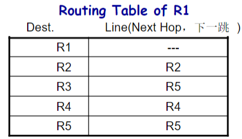

假设主机 H1 的进程 P1 要向主机 H2 发送数据包。数据包首先到达路由器 A，A 根据自身路由表（假设是初始路由表）决定将数据包转发给 C，C 再根据自己的路由表继续转发，经过一系列路由器的转发，最终到达路由器 E，E 再将数据包转发给 F，由 F 交付给主机 H2。

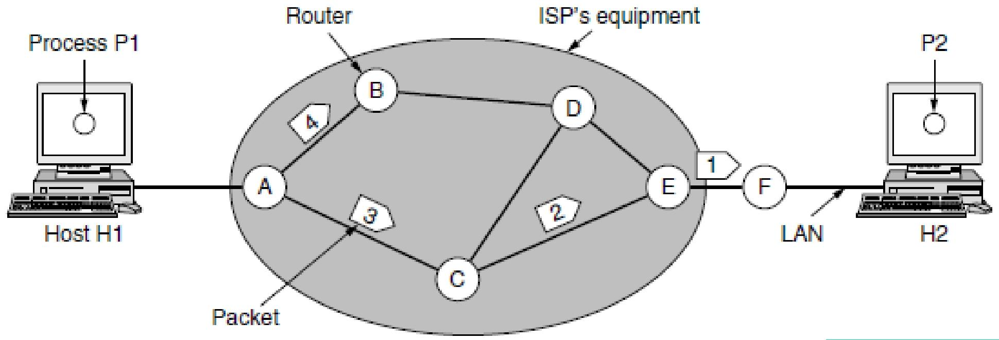

在此过程中，如果网络拓扑发生变化，比如 A 到 B 的链路变得更优，A 的路由表更新后，后续前往 B 方向的数据包就可能直接转发给 B

### Virtual Circuit(虚电路) Network

* 电路交换网络和数据报网络的一种结合 `A cross between a circuit-switched network and a datagram network.`
* 在数据传输前，会建立虚电路并确定端到端的路径 `Virtual circuit is established and end-to-end path is decided before data transmission`
* 本地有效+长度优势 `Virtual Circuit Identifier(VCI): local significant`

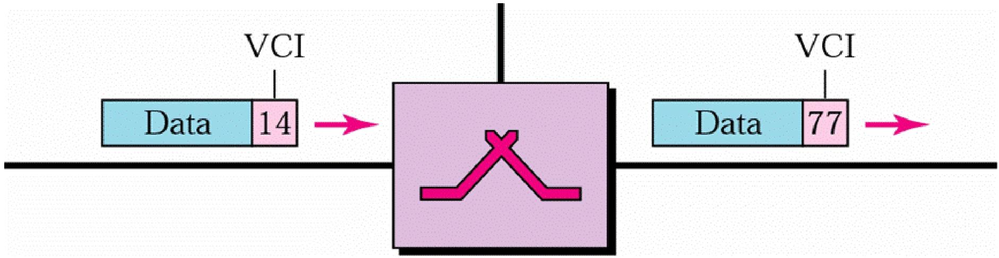

## Routing within a Virtual-circuit Subnet

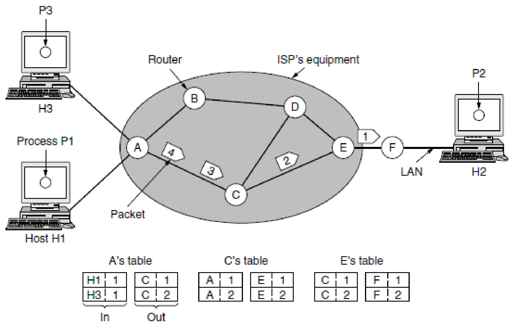

#### 网络组成部分

* **主机（Host）** ：图中的 H1、H2、H3 代表不同的主机，主机上运行着进程（如 Process P1、P2、P3 ），是数据的源端或目的端。
* **路由器（Router）** ：图中的 A、B、C、D、E 是路由器，负责根据路由表转发数据分组（Packet） 。
* **ISP 设备（ISP's equipment）** ：灰色椭圆区域代表互联网服务提供商的设备，是路由器所在的网络环境。
* **局域网（LAN）** ：连接主机 H2 和路由器 F，是局部区域的网络连接。

#### 路由表（Routing Table）

图中给出了路由器 A、C、E 的路由表：

* **路由器 A 的表（A's table）** ：
  * 对于来自 H1 的输入（In），输出（Out）到 C，端口为 1 ；对于来自 H3 的输入，输出到 C，端口为 2 。
  * 作用是确定从主机 H1、H3 进入路由器 A 的数据分组的转发方向。
* **路由器 C 的表（C's table）** ：
  * 来自 A 的输入，根据不同情况输出到 E（端口 1 或 2 ）。用于在路由器 C 上确定从 A 过来的数据分组如何继续转发。
* **路由器 E 的表（E's table）** ：
  * 来自 C 的输入，输出到 F（端口 1 或 2 ），用于将数据分组向目的主机 H2 方向转发。

#### 虚拟电路（Virtual Circuit，VC）

图中定义了两条虚拟电路：

* **VC1** ：路径为 H1 - A - C - E - F - H2，即主机 H1 到主机 H2 建立的一条虚拟连接，数据沿着这条预先确定的路径传输。
* **VC2** ：路径为 H3 - A - C - E - F - H2，是主机 H3 到主机 H2 建立的虚拟连接。

在虚拟电路子网中，建立虚拟电路时会确定路径，数据分组沿着该路径转发，路由器根据路由表中的映射关系，将输入端口和相关标识的分组，从指定输出端口转发出去，确保数据按预定路径到达目的主机

| Issue                     | Datagram network                                             | Virtual - circuit network                                        |
| ------------------------- | ------------------------------------------------------------ | ---------------------------------------------------------------- |
| Circuit setup             | Not needed                                                   | Required                                                         |
| Addressing                | Each packet contains the full source and destination address | Each packet contains a short VC number                           |
| State information         | Routers do not hold state information about connections      | Each VC requires router table space per connection               |
| Routing                   | Each packet is routed independently                          | Route chosen when VC is set up; all packets follow it            |
| Effect of router failures | None, except for packets lost during the crash               | All VCs that passed through the failed router are terminated     |
| Quality of service        | Difficult                                                    | Easy if enough resources can be allocated in advance for each VC |
| Congestion control        | Difficult                                                    | Easy if enough resources can be allocated in advance for each VC |

# 路由算法 Routing Algorithms

## 路由概述

* 互联网是由路由器连接起来的多个网络的集合 `An internet(互联网) is a combination of networks connected by routers.`
* 数据在网络中传输时，路由器不断转发  `When a packet goes from a source to a destination, it may pass through many routers.`
* 路由器在转发数据分组时会查阅路由表，路由表为数据分组指定最佳路径 `A router consults a routing table when a packet is ready to be forwarded. The routing table specifies the optimum path (最佳路径)for the packet.`

### 两种路由表

* **静态路由表（Static table）**
  * **特性** ：不频繁更改。其中的信息由手动输入，通常保持不变 。
  * `A static routing table contains information entered manually Usually remained unchanged.`
* **动态路由表（Dynamic table）**
  * **特性** ：当网络中某处发生变化时，会自动更新。
  * `A dynamic routing table is updated periodically or whenever necessarily using one of the dynamic routing protocols such as RIP, OSPF, or BGP.`

### **路由算法（Routing Algorithms）**

**定义** ：是用于构建和更新路由表的算法。

路由算法负责决定一个输入分组应该从哪个输出线路进行传输 。

* **数据报网络（datagrams ）** ：在子网内部使用数据报时，对于每个到达的数据分组都必须做出路由决策。即每个分组独立寻址、选路，不同分组可能走不同路径 。
  * 数据报网络对每个包选路
* **虚电路网络（virtual circuits ）** ：在子网内部使用虚电路时，仅在建立新的虚电路时进行路由决策。之后，数据分组就沿着之前建立好的路由传输 。
  * 虚电路网络，只在建立虚电路时选路

Routing(选路) & Forwarding(转发)

#### 非自适应算法 Nonadaptive algorithms (Static Routing)

* **路径计算方式** ：路由路径的选择是提前离线计算好的，在网络启动时下载到路由器中。这意味着路径规划不依赖网络实时状态 。
* **决策依据** ：路由决策不基于当前流量和拓扑的测量或估计值。其路由策略相对固定，不随网络状况动态调整 。

#### 自适应算法 Adaptive algorithms

* **动态调整机制** ：会改变路由决策，以反映网络拓扑的变化，通常也会考虑流量变化。能根据网络实时状态，如链路故障、流量拥塞等情况，灵活调整路由路径 。

### **路由协议（Routing Protocols）**

**定义** ：是一组规则和过程，使路由器在网络发生变化时能相互通知，主要基于不同网络间路由器信息的共享与整合 。

### Routing table: Next-hop(下一跳) routing

## Optimality principle

* Correctness 正确性
* Simplicity 简单性
* Robustness 健壮性
* Stability
* Fairness 公平性
* Optimality 最优性
  * Minimizing mean packet delay
  * Maximizing total network throughput

### The Optimality Principle(最优化原则)

**原理：**如果路由器 J 在从路由器 I 到路由器 K 的最优路径上，那么从 J 到 K 的最优路径也在同一条路线上。

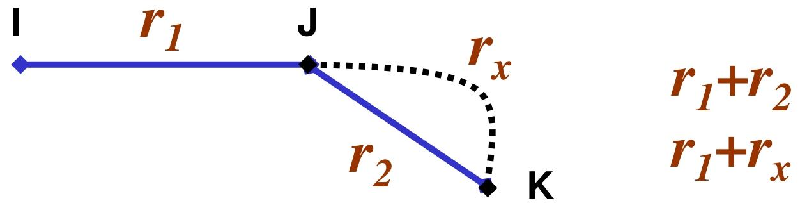

`If a route `

## Sink Tree(宿树/汇集树)

* 以目的节点为根,由所有源节点到目的节点 的最优路由构成 `Optimal routes from all sources to a destination, form a tree rooted at the destination`
* 宿树不包含任何环路 `Does not contain any loops, so each packet will be delivered within a finite number of hops`
  * 因为没有环路，数据包从源节点出发，沿着宿树的路径转发，经过有限数量的跳数就能到达目的节点 。
* 衡量路由算法优劣的基准 `A benchmark to measure routing algorithms`

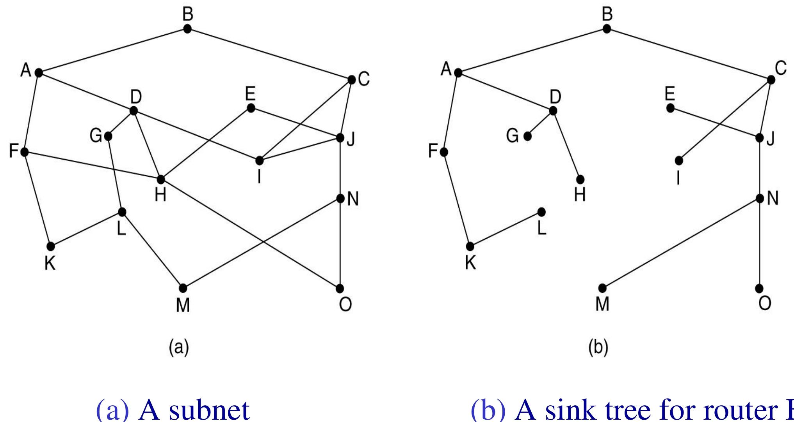

### Major Routing Strategies

* Fixed Routing(固定查表选路)
  * 为每一对源 - 目的节点组合预先设定一条固定不变的永久路由。
* Flooding(洪泛/泛洪)
  * 节点将数据包发送给其所有邻居节点
  * 接收到数据包的节点，会把数据包转发到除接收链路外的所有链路
* Random Routing(随机选路)
  * 节点从可用的输出路径中选择一条来转发接收到的数据包
  * 选择方式可以是完全随机，也可以是轮询
* Adaptive Routing(自适应选路)
  * 根据网络状态变化（如拓扑结构改变、链路拥塞等）动态调整路由决策
  * Requires information about network
  * Used by almost all packet switching networks

# Flooding 洪泛法

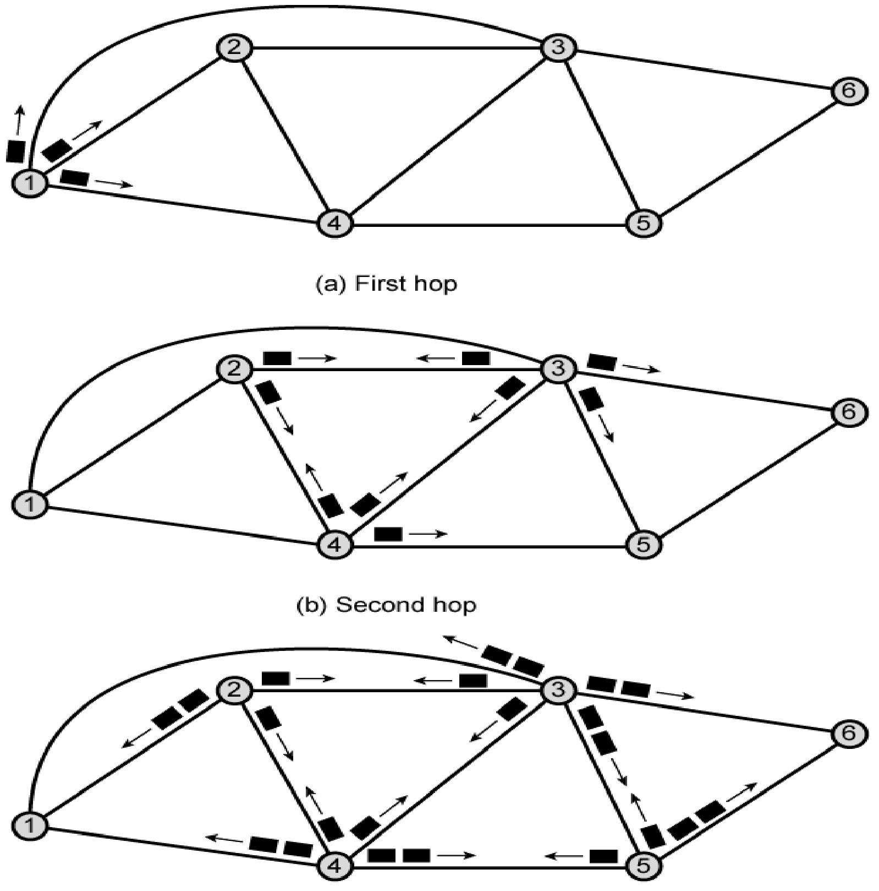

* 无需路由表
* 无需网络信息
* 接收到的数据包会在除输入链路外的每条链路上重新传输
* 最终会有若干副本到达目的地

**问题：产生大量重复包**

**方案：**

* **跳计数器（hop counter）机制**
  * 在每个数据包的头部包含一个跳计数器。每经过一个节点（一跳），计数器的值就减 1 。当计数器的值减为 0 时，该数据包将被丢弃 。
  * 限制转发次数
* **序列号（sequence number）机制**
  * 源节点在每个数据包中放入一个序列号。每个路由器记录每个源节点发出数据包的最大序列号，以此来判断哪些序列号的数据包已经被处理过。
  * 防止重复包

# Dijkstra

已学，一样

# 距离矢量选路 Distance Vector Routing（谣传选路）

* 每台路由器维护一个路由表（Vector ）

  * 路由表记录了到各个目的网络的相关信息
* 距离度量

  * 记录到每个目的地的最佳已知距离，同时还记录下一跳/接口信息，确认转发路径
  * 距离的度量方式可以是跳数（hops ），即数据包到达目的地需要经过的路由器数量；也可以是时延（单位毫秒等 ）等其他度量方式。
* 路由表更新

  * 通过与相邻路由器交换信息来更新路由表 。
  * **信息发送** ：发送的路由信息包含（目的地，距离）。以 RIP（Routing Information Protocol，路由信息协议 ）为例，它周期性（每 30 秒 ）发送这些信息。
  * **信息接收处理** ：当路由器接收到路由信息时，如果收到更好的路由（比如距离更短 ），就更新本地路由表。同时，会刷新现有路由，计算时不使用旧的路由表信息。
  * **超时处理** ：如果路由表中的条目超时（如 RIP 中 180 秒 ），则删除这些条目。

## 特点

* 与邻居共享整个网络的信息
* 仅与邻居节点共享,把已知的网络信息发送到所有接口
* 每隔一段时间共享

缺点：

* 收敛慢
* 好消息扩散快,坏消息传播慢

## 无线环路 DVR: Count-to-Infinity

距离向量路由协议在网络拓扑变化时，路由信息更新机制存在缺陷导致的。当网络中链路出现故障等情况，路由器间依据距离向量不断交换路由信息，可能会使路由度量值（如跳数）不断增大，陷入无穷循环，无法收敛到正确路由。

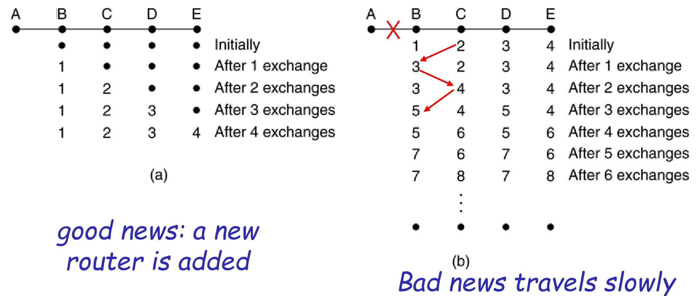

* **图 (a)** ：假设链路正常时，各节点记录到其他节点的距离（跳数 ）。当某条链路（比如 C - D 间链路 ）突然断开，节点 C 原本到 D 及后续节点（E 等 ）的路径失效，但 C 还不知道，仍将旧路由信息发给邻居（如 B ）。B 收到 C 的信息后，认为通过 C 能到达 D 和 E ，更新自己路由表，且跳数 +1 。经过多次交换，各节点跳数不断增加，在链路断开情况下，却还在尝试通过错误路径转发数据。
* **图 (b)** ：同样展示了链路故障后，随着路由信息交换次数增加，节点记录的到其他节点距离不断增大，陷入无穷计数状态。这就是 “坏消息传播慢” 的体现，链路断开这个负面消息不能及时准确传递给所有路由器，导致错误路由信息在网络中持续传播，路由表无法正确收敛 。

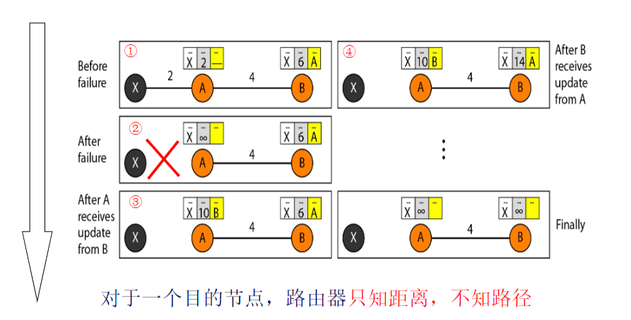

## 小结

### 应用于协议

* 选路(路由)信息协议RIP
* Cisco的EIGRP (增强的内部网关选路协议)

### DVR的问题

* 当X告诉Y自己有一条路径时,Y没办法知道自己是否在这条路径上(即是否存在环路)
* 基于谣传的选路

### 改进:基于路径的选路

* BGP-4 (边界网络协议)
* IDRP (域间选路协议)

# 链路状态选路 Link State Routing

* 共享部分网络拓扑结构
* 与每个路由器共享
* 在网络中发生变化时共享

从收到的LSP,路由器可以获知整个网络的拓扑结构, 然后可以计算出自己到其他路由器的最短路径

## 路由器特点

路由器知道全网的拓扑结构

每个路由器必须完成下列任务:

1. 发现邻居,获得邻居的网络地址
2. 测量到每个林觉的时延或开销
3. 构造一个包(LSP:链路状态包),包含它刚学习到的 信息(部分网络拓扑)
4. 将LSP可靠地发给网络中所有其他路由器
5. 计算到每个其他路由器的最短路径

## HELLO包

* 在广播网络中,广播特殊的HELLO包
* 对于点到点网络,将HELLO包直接发送给邻居(单播)

## 第1步:学习邻居的信息

对于点到点网络,将HELLO包直接发送给邻居(单播)

邻居发回响应,告知自己的名字或地址（ID单一）

当两个或多个路由器连接到一个LAN上或者其他多路 访问网络上

## 第2步:测量线路开销

* 用环回时间来测量(ECHO 包)
* 带宽
* 考虑负载，震荡导致不稳定

## 第3步:构造链路状态包

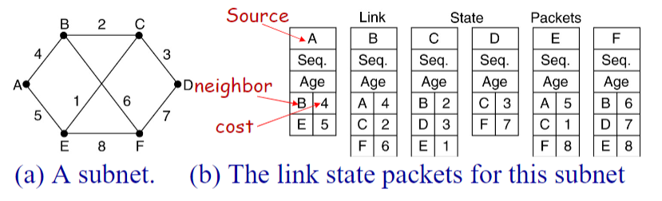

时机：

* 周期性构造
* 当某些重要的事情发生时

**序号:**用于检查收到的LSP是不是新的

* 如果LSP是新的,以洪泛方式转发
* 如果LSP是重复的,丢弃
* 

**年龄:**用于删除循环的LSP

* 如果一个路由器崩溃了
* 如果一个路由器改变了路由器ID
* 如果一个路由器要删除一个LSP

## 第4步:分发链路状态包

可靠地分发LSPDistributing the LSP reliably

基本分发算法:

* 使用洪泛法(flooding) 来分发LSP
* 为防止路由器-路由器的线路上出现差错,所有LSP 都要进行确认

## 第5步:计算新路由

* 当路由器收到全部LSP后,就可以构造全网 的拓扑结构图
  * 每条链路在图中表示两次(有向图)，每次表示一个方向；其权值可以取平均值,也可以两个方向分别表示
* 在本地执行Dijkstra算法以构造到所有可能 目的地的最短路径
* 将算法的结果安装到路由表中

# 分级选路

？

分级选路:简化路由表

域内:选路到路由器;域间:选路到域

# 距离矢量选路vs 链路状态选路

|                   | DVR                     | LSR                         |
| ----------------- | ----------------------- | --------------------------- |
| 共享什么信息?     | 路由表(目的地址和距 离) | 已知网络拓扑 (LSP)          |
| 和谁共享?         | 邻居                    | 网络中的所有路由器          |
| 何时共享?         | 周期性                  | 网络中有(拓扑或负载) 变化时 |
| 路由器知道什么?   | 只知距离,不知路径       | 整个网络的拓扑结构          |
| 有无穷计数问题吗? | 有                      | 无                          |

# 拥塞控制和互连互通

## 拥塞

源主机太快地发送太多数据，以至于网络不能处理（资源不足）

如果网络上的负载(发送到网络中的数据包数量)超过了网 络的容量(网络能够处理的数据包数量)，将发生拥塞，性能将严重下降

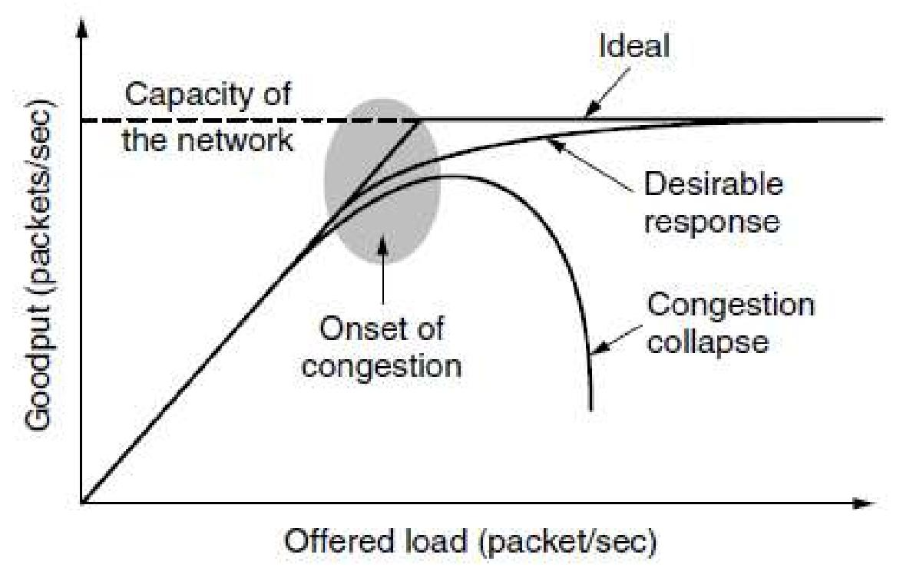

### 原因

* 如果包的到达率比包处理速率高,输入队列将越来越长
* 如果包离开的速率比处理速率高,输出队列将越来越长

次要因素：

* CPU处理速度慢
* 链路带宽低
* 缓冲队列短

## 网络的性能:时延和吞吐量

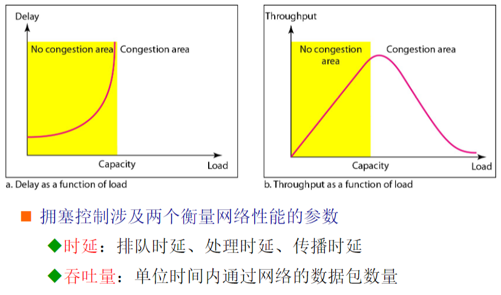

## 拥塞解决方案

* 增加资源
  * 网络提供
    * 规划､调整网络,以适应业务量(负载)
    * 构造一个可以与承载的业务量匹配良好的网络
    * 当严重拥塞时,动态增加资源
    * 对于经常性利用率过高的链路和路由器,应尽快升级
  * 业务量感知的路由
    * 普通机制：使用固定链路权值,适应拓扑结构的变化,但不适应负载的改变
    * 业务量感知：链路权值:链路带宽､传播时延､加上度量出的负载或平均排队时延的综合函数
* 减少负载
  * 接纳控制
    * 增加的业务量会导致网络拥塞，就不允许建立虚电路
    * 配备业务量描述（通过漏桶或令牌桶），网络可以决定是否接纳新的虚电路
    * 与业务量感知的选路相结合：在建立VC时，考虑绕开业务量热点的路径
  * 业务量减速/节流
    * 第1步:路由器检测到拥塞
      * 输出链路的利用率
      * 路由器内部的数据包排队的缓存(队列长度)
      * 由于缓存不足而丢失的数据包的数量
      * 对排队时延的估测:
      * $d_{new }=\alpha d_{old }+(1-\alpha) s$
    * 第2步:传送关于拥塞的信息
    * 第3步:调整系统操作
      * 收到抑制分组,源主机可以将发送给对应目的主机 的业务量减少x%(例如50%)

## 其它反馈机制

### 逐跳反压

a) 普通抑制分组:只 有主机响应

b) 逐跳反压:沿途 每一跳(路由器) 都响应

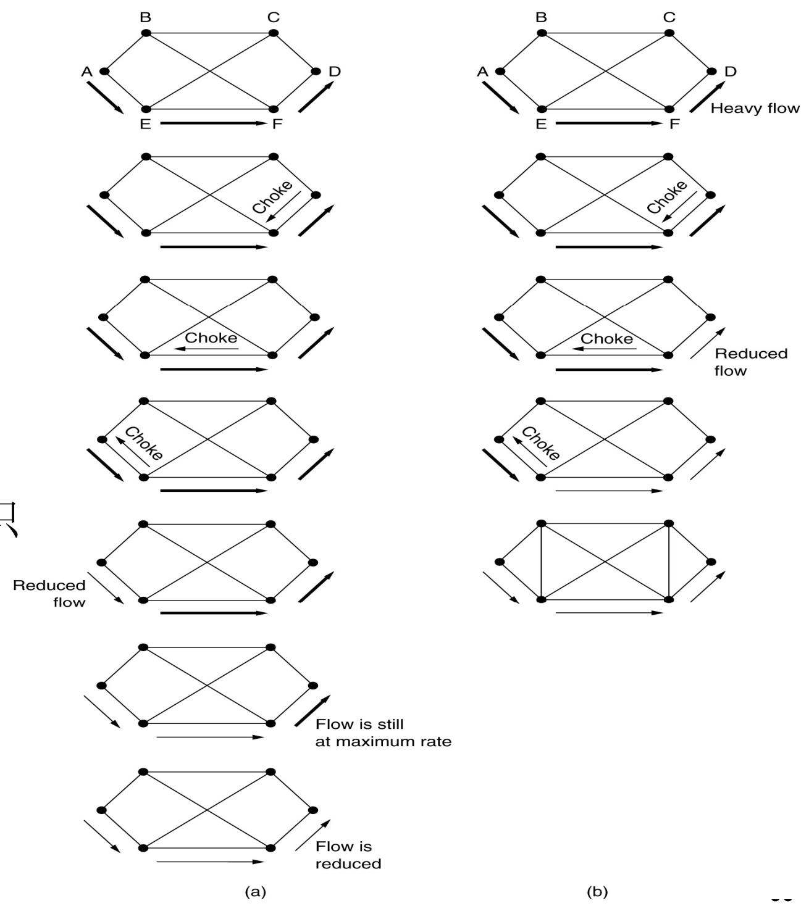

### 显式拥塞通知 ECN

* IP和TCP使用
* IP包头的两个比特用于记录该包是否遇到拥塞
* 检测到拥塞的路由器在转发时给数据包加上标记
* 作为显式拥塞通知,目的主机在下一个回应的数据包中,将标记反馈回源主机

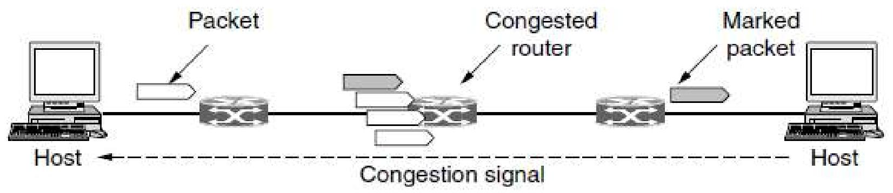

# 负载掉落

## 丢包

路由器由于数据包而不胜负荷时，把这些包丢掉

### 随机丢包

红酒法vs. 牛奶法

### 智能丢包

## 因特网的负载掉落: Random Early Detection (随机早期检测)

* 在情况变得极差之前丢包
  * 当某条线路的平均队列长度超过阈值时,就认为该线路拥塞, 将随机丢弃少量包
* 路由器只是丢弃选中的包
  * 相关源主机在没有收到ACK时,发现包丢失,隐式通知
* 反应：源主机降低发送速率

## 差异

### 流量控制

* 避免淹没接收方
* 局部问题,只涉及通信双方:发送方和接收方

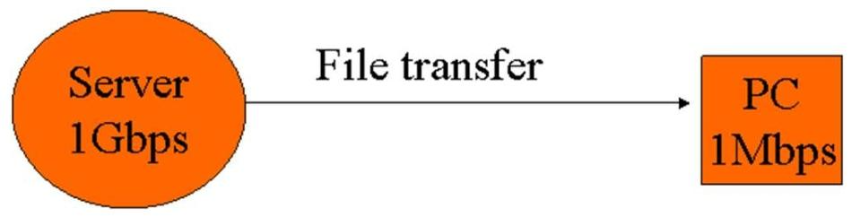

### 拥塞控制

* 避免网络拥塞
* 全局问题,涉及路径上所有主机/节点

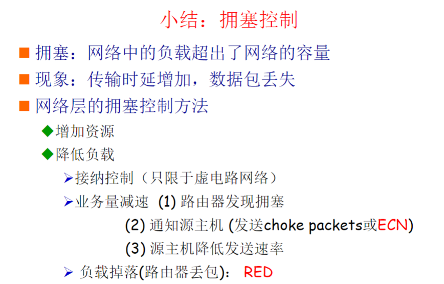

# QoS 服务质量参数

## 主要参数

* 可靠性
  * 包差错率
  * 包丢失率
* 时延
  * 从发送第1个比特到最后1个比特被接收 的时间
* 抖动Jitter（时延）
  * 属于同一个流的各包时 延的差值
* 带宽：最大数据率

## 漏桶和令牌桶

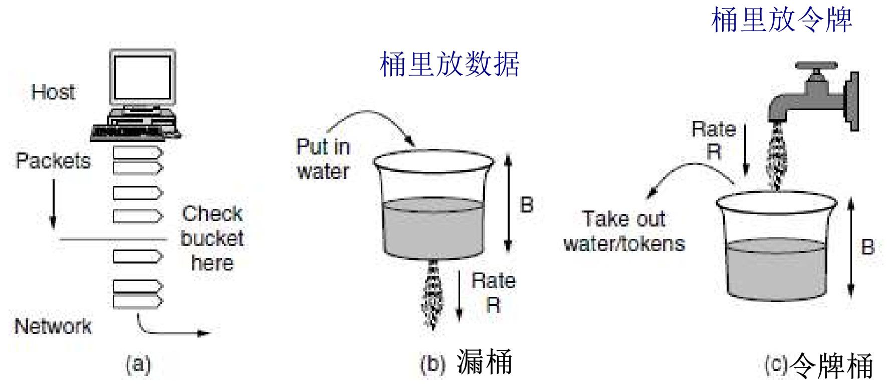

### 漏桶：漏斗队列

将不规则的包流变成规则的流

以字节计数的漏桶

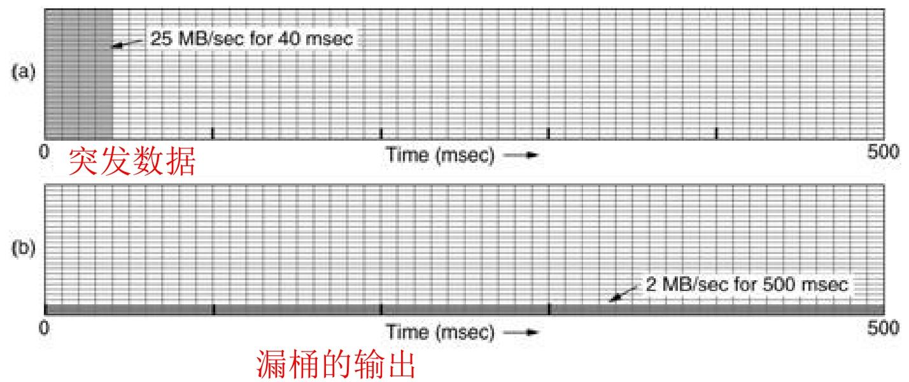

局限性:桶满时,则后续数据被丢弃

### 令牌桶算法

令牌桶允许空闲的主机积累信用（令牌）备用，但不超过调整后最大长度

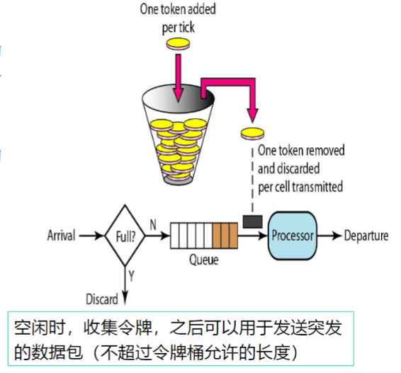

### 比较

* 突发性
  * **漏桶**算法强制以固定的平均速率模式输出,而不管业务量的突发性如何
  * **令牌桶**在输出的数据流中允许一定的突发性
* 当桶满时
  * **令牌**桶扔掉令牌,但不丢弃数据包
  * **漏桶**算法丢弃数据包

### 以最大速率突发的长度

* 突发长度S 秒
* 令牌桶容量B 字节
* 令牌到达速率R 字节/秒
* 最大输出速率M 字节/秒

$$
输出的突发最大量为:B + RS 字节
$$

$$
B+R S=M S
$$

$$
S=B /(M-R)
$$

如果B=9600KB, \(M=125 MB / sec\) , \(R=25 MB / sec\)

$$
则 S=96 ms
$$

## 提高QoS的技术

### 业务量整形

调整数据发送的平均速率(和突发性)，使业务量平滑 (去突发)

主因：**业务量突发:**主机不规律地发送数据包,可能导致网络中出现拥塞

### 分组(包)调度

#### 流

* 从某个源主机发往某个目的主机的一系列数据包

#### 分组调度

假定属于一个流的数据包都选择同样的路由

在竞争的流之间，为一个流的包分配路由器资源

### FIFO:先进先出队列

丢弃尾部:当队列满时,新到达的包将被丢弃

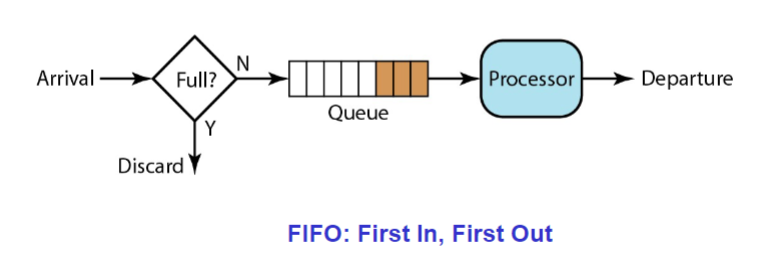

### 优先级队列

* 先给包分配一个优先级｡每个优先级有单独的队列
* 当有空闲线路时,首先处理最高优先级的队列中的包
* QoS较好：诸如多媒体的高优先级业务量能以较小的时延到达目的地
* 潜在问题:低优先级数据可能一直等待,不公平

### 公平队列

* 以循环方式来处理包（轮流处理每个队列中的包)

### 公平加权队列

* 优先级队列+ 公平队列(按权值轮流)
* 队列的权值基于优先级,高优先级意味着高权值
* 系统轮流处理每个队列,按权值选择一次处理的包的个数

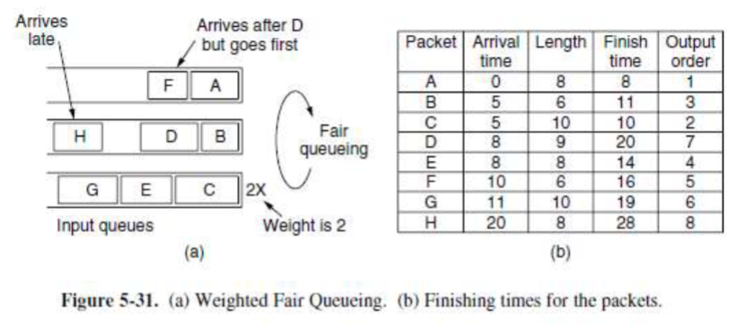

$$
F_{i}=max \left(A_{i}, F_{i-1}\right)+\frac{L_{i}}{W}
$$

F: finish time, A: Arrival time, L: length of packet, W :weight

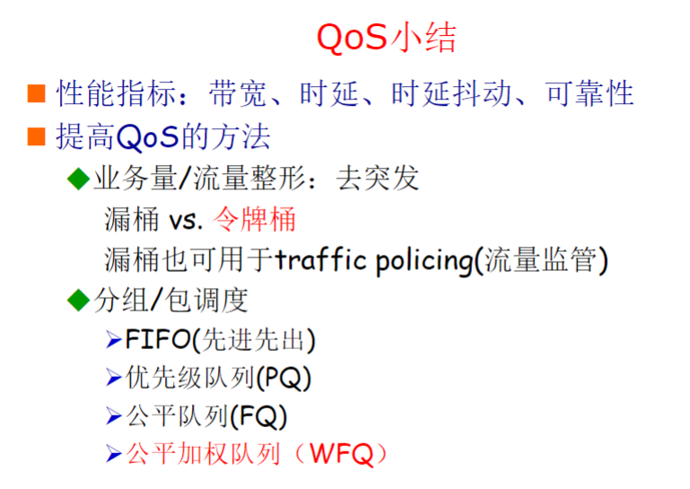

# 网络互连

## 不同层次互联

1. 第1层: 中继器､HUB
2. 第2层: 网桥､交换机
3. 第3层: 路由器(包翻译)
4. 第4层: 传输网关
5. 4层以上:应用网关

### 交换机vs. 路由器

* LAN交换机: 基于MAC地址转发整个帧,
* 路由器: 从帧中取出数据包,使用3层地址确定如何转发

### 隧道

源主机和目的主机在相同类型的网络上,但中间是不同的网络

源主机发出的包,封装在中间网络的包中

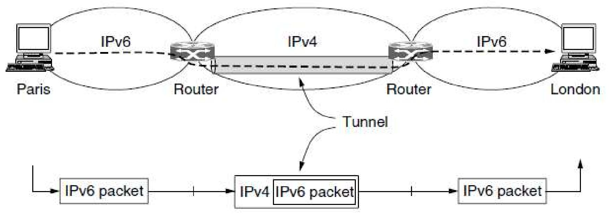

因此需要用中间网络的协议封装源主机发送的数据包

## 互联网选路

### 两级选路算法

* 每个网络内部,使用域内或内部网关协议选路
* 在组成互联网的各网络之间,使用域间或外部网关协 议选路

# 因特网的网络层

## 网际互连协议IP

* 应用最广泛的网络互通协议
* 无连接的网络层协议
* 基于数据报选路
* 提供尽力而为服务,不可靠!
* IP的选路混合了层次选路､距离矢量选路和链路状态选路

使用统一的全局地址

### IPv4的编址

因特网地址(IP地址):用于标识连接到因特网的每个设备的网络层标识符

* 32位､点分十进制记法
* 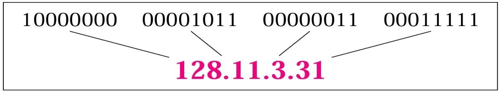
* 统一编址
* 对每个网络接口唯一,与物理地址无关,定义到因特网 的一个连接
* 如果一台主机/路由器有两个接口连接到因特网,就有两 个IP地址

#### 分类地址

IP在A类､B类和C类地址,至少传统上采用两级层次化编址机制:网络号(net-id) + 主机号(host-id)

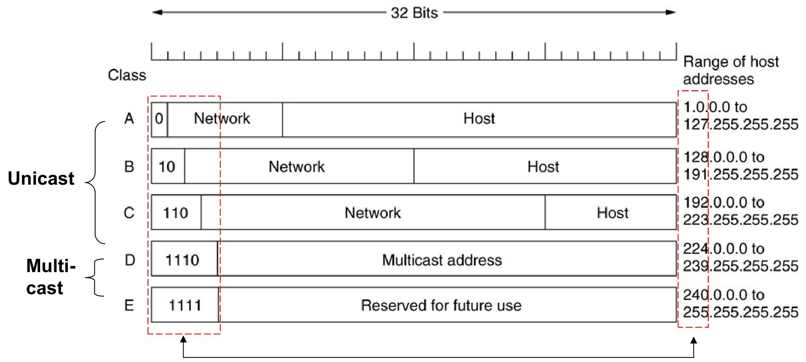

* 网络地址是地址块中的第一个地址,是分配给网络所属 的机构
* 网络号部分保留,主机号部分为0
* 对网络中的任一个地址应用默认/缺省掩码,就可以得 到网络地址
  * 将该IP地址与子网掩码“按位与”

默认掩码:

* A类:255.0.0.0
* B类:255.255.0.0
* C类:255.255.255.0

在进行路由选择时，外部世界以网络地址来识别网络，而不是单独的各主机的IP地址

## 子网划分

目的：更有效地管理IP地址和对为数据包选路

* 在内部使用上，一个网络分成几个部分；但对外部世界仍然是一个网络，以网络地址为标识
* 子网划分对于外部不可见
* 子网使用部分主机号来标识物理网络

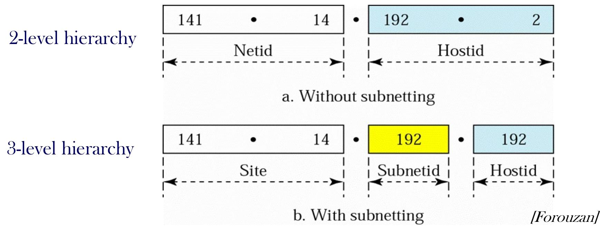

### 子网掩码

子网掩码是一个 32 位的二进制数（通常用点分十进制表示，如 255.255.240.0 ），它的作用是区分 IP 地址中的网络部分和主机部分。对于 IPv4 地址，网络位对应的子网掩码位为 1，主机位对应的子网掩码位为 0 。

* 路由器通过子网掩码获取网络地址
* 在选路时将目的地址与子网掩码按位“与”

## 超网划分

C类地址的问题:地址块内太小,难以满足一个机构/ 单位的需求

* 将几个连续的C类地址块合并,以建立一个大地址块
* 即几个网络合并成为一个超网
* 合并的C类网络个数一定是2的幂次
* 在地址空间上必须连续(地址块之间不能有空隙)

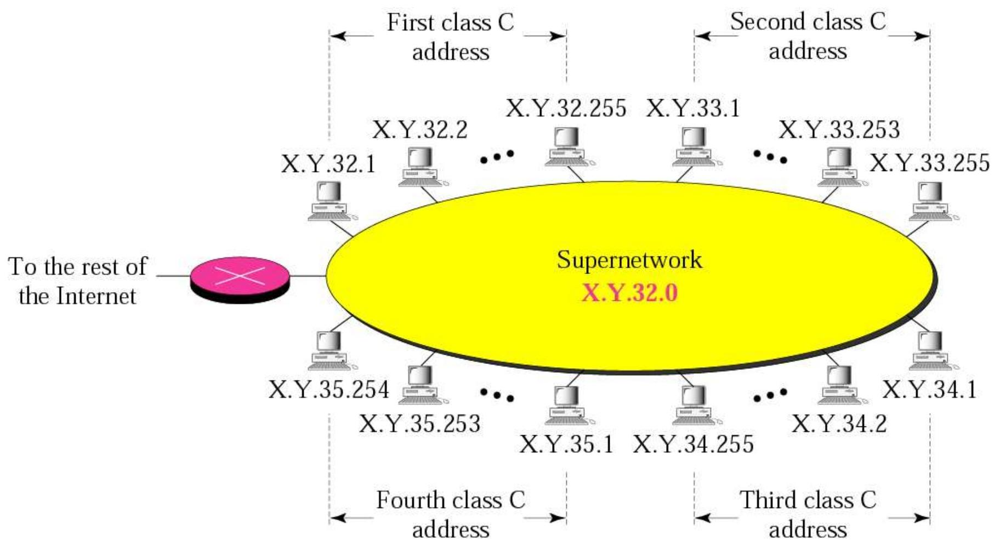

4个c类子网合并成超网

超网掩码为 255.255.252.0 ，转换为二进制形式是 11111111.11111111.11111100.00000000 。可以看出，它比 C 类地址默认的子网掩码（255.255.255.0 ，即 11111111.11111111.11111111.00000000 ）少了 2 位网络位。这是因为合并了 4 个C 类地址块，根据超网划分规则，每合并 2 的 **n** 次幂个 C 类地址块，子网掩码的网络位就减少 **n** 位

### 子网掩码､默认掩码与超网掩码

#### 默认掩码

* IP 地址分类体系下，各类地址默认的子网掩码
* A 255:0:0:0
* B 255:255:0:0
* C 255:255:255:0

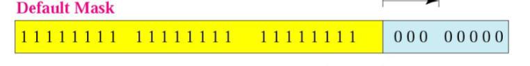

#### 子网掩码

* 在默认掩码基础上，通过借用主机位来标识子网
* 当进行子网划分时，将默认掩码中原本属于主机位的若干位设置为 1
* 进一步细分网络

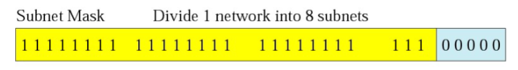

#### 超网掩码

* 与子网掩码相反，是在默认掩码基础上减少网络位
* 将多个连续网络合并，需要减少默认掩码中网络位的位数

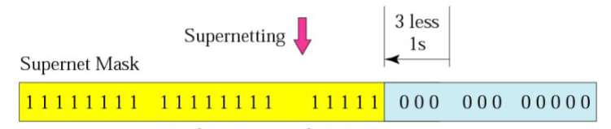

## 无类别地址

因特网持续的指数级增长导致A、B、C类地址空间将耗尽

采用可变长地址块，不分类

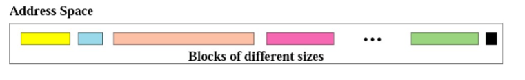

### 无类别域间选路CIDR

#### CIDR地址格式:“/前缀”记法

CIDR（Classless Inter - Domain Routing）采用 “/ 前缀” 的记法来表示 IP 地址

在 “a.b.c.d/x” 中，“a.b.c.d” 是 IP 地址的点分十进制表示形式，“x” 表示地址中网络部分的位数

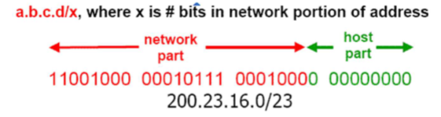

#### 编址规则

一个网络(子网)的地址数量一定是2的幂次

起始地址一定能够整除地址个数

#### CIDR: 路由聚合/汇聚

将多个连续的网络地址块合并成一个更大的地址块进行路由

将多个相关的路由条目合并为一个，使路由表减小

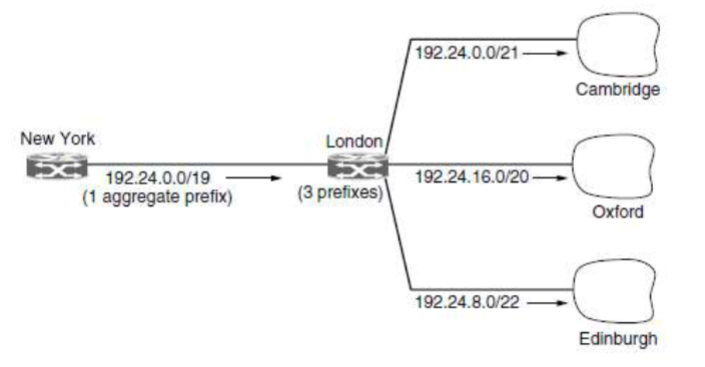

利用 CIDR，可将London中的三个IP聚合为 192.24.0.0/19

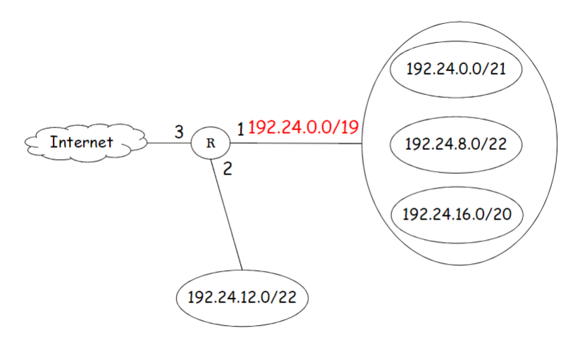

前 19 位是相同的。根据 CIDR 规则，可以将它们聚合为 192.24.0.0/19

## 网内的地址数与可分配(可用)地址

1. **网络地址表示**
   网络地址采用 “x.x.x.x/m” 的形式，其中 “x.x.x.x” 是 IP 地址的点分十进制表示，“m” 是 CIDR（无类别域间选路）前缀，代表网络号的位数 。
2. **网络号与主机号位数关系**
   在 32 位的 IPv4 地址中，网络号占 m 位，那么主机号的位数 **n**=**32**−**m** 。例如，对于网络地址 192.168.1.0/24 ，这里 **m**=**24** ，则主机号位数 **n**=**32**−**24**=**8** 。
3. **网络内地址总数计算**
   根据二进制原理，主机号有 **n** 位时，不同组合的数量为 **2**n ，所以该网络内共有的地址数为 **2**n 个。比如上述例子中，主机号 8 位，那么网络内地址总数为 **2**8**=**256 个 。
4. **特殊地址说明**
   * **网络地址** ：网络内第一个地址，其主机号部分全为 0 ，用于标识整个网络。例如 192.168.1.0/24 中，192.168.1.0 就是网络地址，它不是分配给具体主机使用的，不能作为主机 IP 。
   * **广播地址** ：网络内最后一个地址，其主机号部分全为 1 ，用于向网络内所有主机发送广播消息。例如 192.168.1.0/24 中，192.168.1.255 就是广播地址，也不能分配给主机 。
5. **可分配（可用）地址数计算**
   由于网络地址和广播地址不能分配给主机使用，所以可分配（可用）地址数为 2^n−**2 。在前面 192.168.1.0/24 的例子中，可分配地址数为 **2**8**−**2**=**254 个，这些地址才是可以分配给网络内主机使用的 IP 地址 。

## NAT: 网络地址翻译

问题:IP地址短缺

**私有地址段：**不能直接在互联网上使用，仅用于内部网络

NAT 路由器负责将内部网络中使用私有地址的源 IP 地址转换为合法的全局 IP 地址（公网 IP）。

当内部主机访问外部网络时，NAT 路由器修改数据包的源 IP 地址，使内部私有地址能够与外部网络通信。

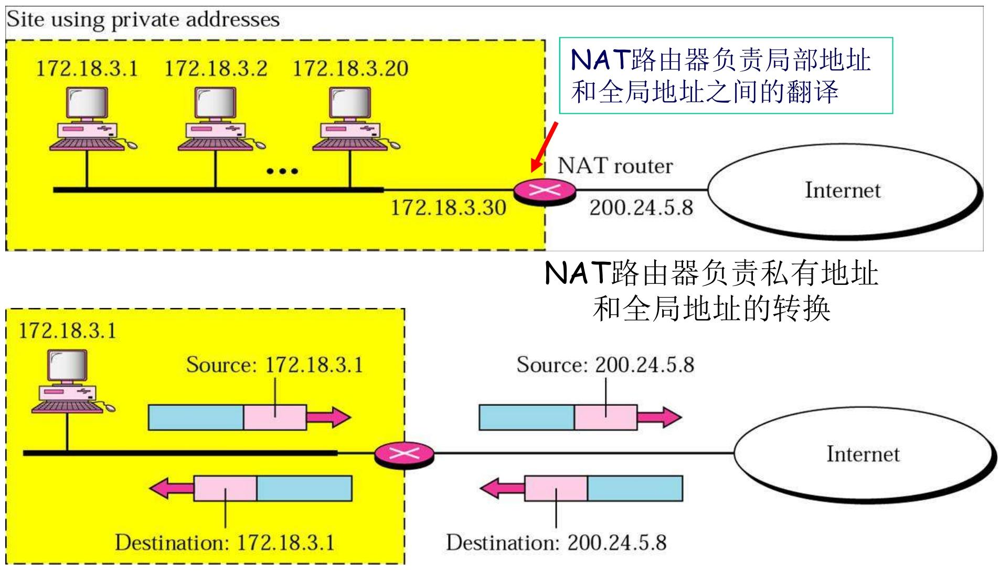

NAT 路由器有两个地址，一个私有地址（172.18.3.30）用于连接内部网络，一个公网地址（200.24.5.8）用于连接 Internet。

一定程度上隐藏内部网络结构，增强网络安全性，因为外部网络只能看到 NAT 路由器的公网地址，难以直接访问内部私有地址设备。

### 多个本地主机同时访问一个外部主机

需要通过端口号来区分

### NAT盒子的位置和操作

NAT 盒子通常位于客户内部网络（如通过客户路由器和局域网组建的网络）与 ISP（互联网服务提供商）路由器连接的边界处，也就是客户网络 premises（场所）的边界位置。

对于输出的包：

* NAT 盒子会将其转换为客户的真实全局地址（公网地址），比如图中从 10.0.0.1 转换为 198.60.42.12 。
* 源端口号会被用作 NAT 盒子翻译表（可容纳 65536 行 ）中的一个索引。

对于输入的包：

* NAT 盒子利用数据包的源端口号作为索引，查找其内部的映射表（翻译表）
* NAT 盒子已经将源端口与内部设备的连接信息关联记录在表中
* 找到对应的映射关系后，NAT 盒子将内部 IP 地址（如 10.x.y.z ）和原始源端口号插入数据包，再转发给内部网络中的目标设备

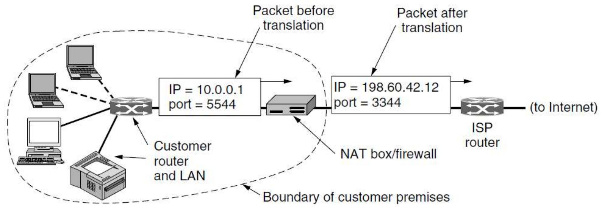

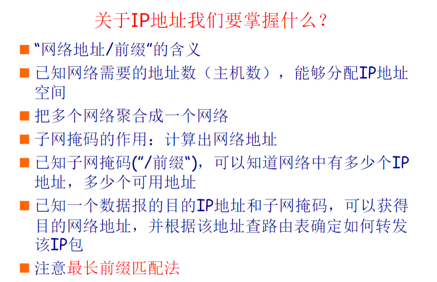

## IP的设计问题

### IP数据报

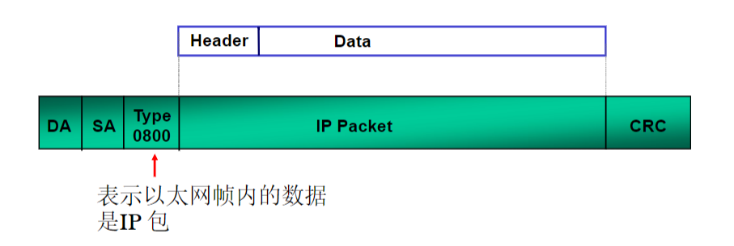

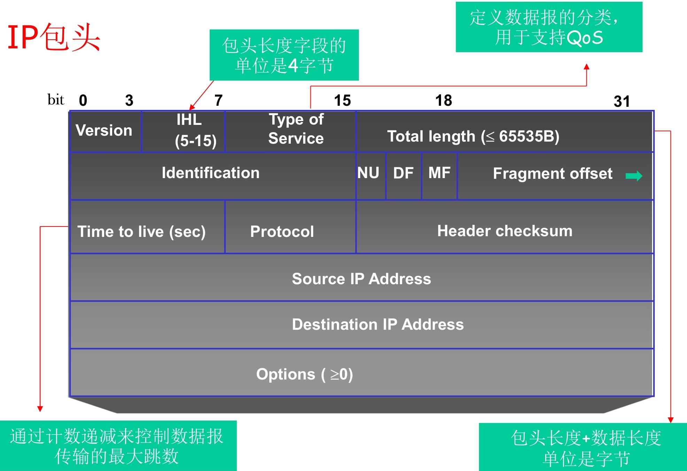

#### 协议字段

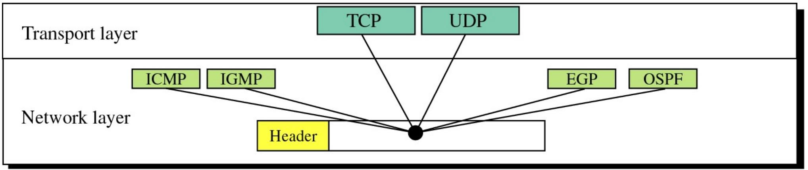

### RFC1071的算法描述

1. 要校验的数据中,一对相邻的八位组形成一个16位整数,可以计算出这些16位整数的1的补码和
   * 1 的补码就是将二进制数中的 0 变为 1，1 变为 0 。例如，二进制数 0101 的 1 的补码是 1010 。通过这种方式把数据按特定格式处理后求和，为后续校验做准备。本质上是异或算术
2. 要产生校验和,校验和字段先清空,计算相关字节的 “1的补码和”,将该和放入校验字段
3. 要检查校验和,在同样的字节集(包括校验字段本身) 中计算“1的补码和” ｡如果结果为全1(补码算法中的 0),即通过校验(判断收到的数据是正确的)

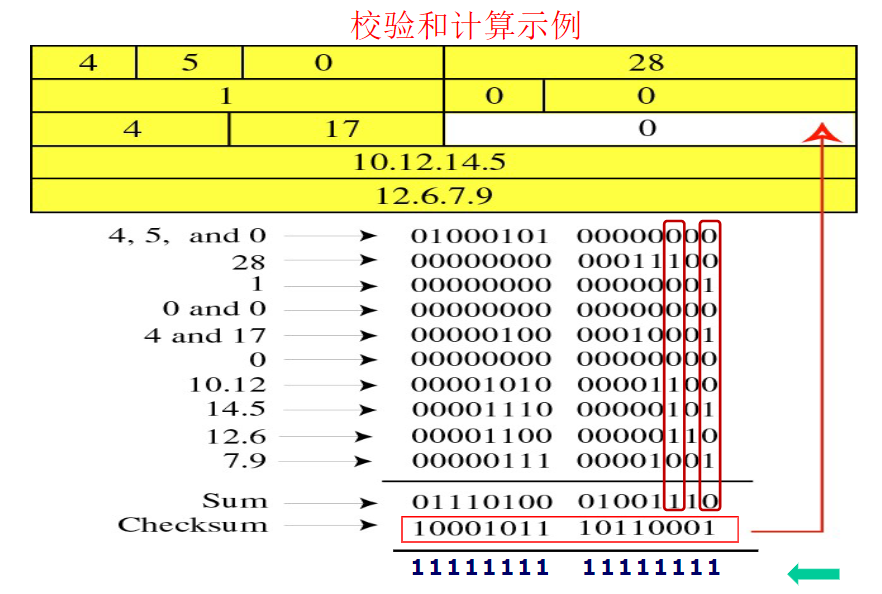

## 分段/分片和重装

由于 IP 数据报在传输过程中会穿越不同类型网络，而各网络的最大帧长（以 MTU 衡量）存在差异

IP 数据报难以以固定大小在所有网络中顺利传输

#### MTU: 最大传输单元

* Ethernet: M T U=1500 B
* WiFi(IEEE802.11): MTU=2312 B

在经过MTU较小的网络时,将数据报分成多个包

* IP数据报可以由源主机或路径上的路由器进行分段
* IP数据报只在目的主机重装
* 片段的大小取决于最小的MTU

### 相关字段

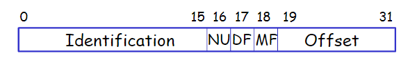

* 数据单元标识符(段标识) Identification
  * 唯一的整数,用于标识数据报
  * 复制到数据报的每个片段中
* DF:当DF=1时,不允许分段
* MF:MF=0表示这是最后一个片段（MORE）
* 偏移量
  * 分段相对于原始的数据报中的位置

## IPv6

* 128位地址
* 8个字段包头
* 安全性: IPv6的关键特性是身份认证和私钥
* 更好地支持选项:对路由器简单,以加快包的处理

包头修改

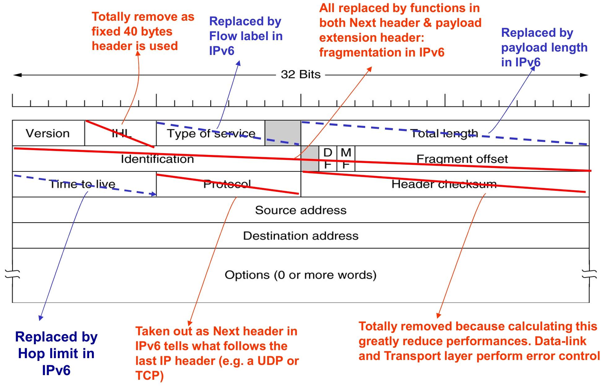

### IPV6数据报

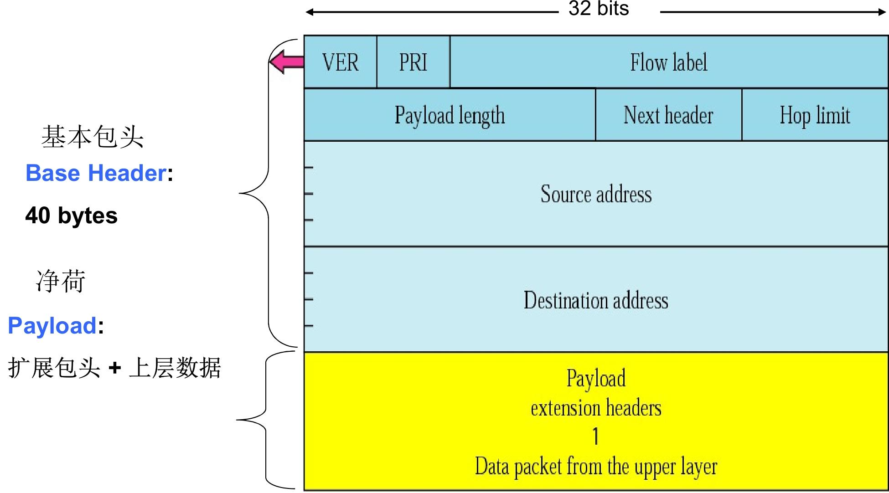

| 字段名称         | 含义                                                                                          |
| ---------------- | --------------------------------------------------------------------------------------------- |
| VER              | IP版本，IPv4值为4，IPv6值为6                                                                  |
| PRI              | 包的优先，0 - 7在出现拥塞时可降低发送速率；8 - 15用于按固定速率发送的实时业务（如音频和视频） |
| 流标签           | 源主机和目的主机之间的伪连接，用于预留资源和满足严格时延要求（仍处于实验性）                  |
| 净荷长度         | 40字节包头之后的净荷（上层数据）的字节数                                                      |
| 下一个包头       | 基本包头之后的包头，或是IP使用的可选扩展包头，或是上层协议（如UDP和TCP ）的包头               |
| 跳限制           | 和IPv4的TTL目的相同                                                                           |
| 源地址和目的地址 | 均为128位                                                                                     |
| 扩展包头         | 对应IPv4的选项                                                                                |

### IPv6 地址的简化规则

#### 前导零省略

IPv6 地址由 8 组 4 位十六进制数构成。像 “0074”“000F”“0000” 这种组内存在前导零的情况，可省略前导零，简化为 “74”“F”“0” 。如从 “FDEC:BA98:0074:3210:000F:BBFF:0000:FFFF” 简化成 “FDEC:BA98:74:3210:F:BBFF:0:FFFF” 。

#### 连续零组缩写

当地址中存在连续的全零组时，可用双冒号 “::” 来表示一组或多组连续的全零组。但要注意，一个 IPv6 地址中只能使用一次双冒号 。例如 “FDEC:0:0:0:0:BBFF:0:FFFF” 可进一步简化为 “FDEC::BBFF:0:FFFF” 。通过这些简化规则，能让冗长的 IPv6 地址书写和阅读起来更方便。

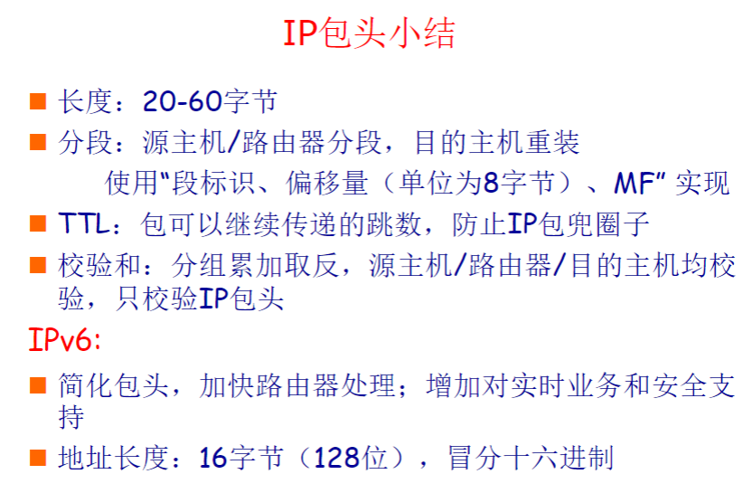

## 不同的网络接入机制

* 在网络层抽象出网络功能,依靠数据链路层提供网络接入
* 路由器处理网络接入机制的不同

### 不同的超时时间

引入数据报生命期概念 ：

* **IP 数据报头字段 - TTL** ：在 IP 数据报头部设置 “生命期（TTL，Time To Live ）” 字段。它就像一个倒计时器，初始值由源主机设定。
* **超时处理** ：每经过一个路由器转发，TTL 值减 1 。当 TTL 值减为 0 时，说明数据报生命期超期，此时路由器不会再转发该数据报，而是直接丢弃，避免其继续在网络中无效循环 。
* **跳计数** ：TTL 本质上也可看作跳计数，记录数据报在网络中经过路由器（跳 ）的数量，限制其在网络中传输的最大跳数，保障网络资源合理使用和传输秩序 。

### 不同的传输模式

* 面向连接vs. 无连接
* IP采用的是无连接的架构

### 差错控制

* 最小差错控制：只对包头进行差错检查
* 路由器通过丢包通知源主机

#### 通知机制

* **丢包通知** ：当路由器检测到数据报出现问题（如无法转发等情况 ）时，会通过丢包的方式通知源主机。这是一种直观的反馈手段，让源主机知晓数据报传输出现异常 。
* **ICMP 协议** ：使用因特网控制报文协议（ICMP）进行通知。ICMP 消息被封装在 IP 包中进行传输 。差错报告消息可由路由器或目的主机发送，常见的情况有：
* **目的地不可达** ：当路由器根据路由表无法找到通往目的地址的路径时，会向源主机发送此类 ICMP 消息，告知目的地址不可达 。
* **TTL = 0** ：如前面提到，当数据报的 TTL 值减为 0 时，路由器会丢弃该数据报，并向源主机发送 ICMP 消息，说明该数据报因 TTL 超时而被丢弃 。
* **IP 包头校验失败** ：若路由器检测到 IP 包头的校验和错误，表明包头在传输过程中出现损坏，会发送 ICMP 消息通知源主机 。
* **ICMP 重定向** ：当路由器发现源主机使用的路由不是最佳路由时，会发送 ICMP 重定向消息，告知源主机存在更好的路由路径，以便后续数据报能更高效传输 。

#### 传输特性与高层协议交互

* **非确保交付（不可靠传输）** ：IP 协议本身提供的是不可靠传输服务，它不保证数据报一定能成功、完整且按序到达目的地。这是网络层的特性，依赖上层协议（如 TCP ）来实现可靠传输 。
* **通知高层协议** ：当出现差错并通过 ICMP 等方式检测到后，可能会将相关差错信息通知给高层协议。例如，TCP 协议可根据这些差错信息进行重传、调整发送策略等操作，以保障应用层数据的可靠传输 。

### 流量控制

* 允许路由器､目的主机限制输入数据的速率
* 发送流量控制包(分组)
* ICMP 消息用于流量控制

## 因特网控制报文协议(ICMP)

#### 向源主机报告意外事件

* **目的地不可达**
  * **路由器找不到目的地** ：当路由器根据自身路由表无法确定通往目的地址的路径时，会向源主机发送 ICMP 目的地不可达消息，告知数据报无法送达目标地址 。
  * **IP 包头 DF = 1（不可分段），但因网络要求 “小包” 无法转发** ：若 IP 数据包设置了不分段标志（DF = 1 ），而途经网络要求数据包长度小于当前包长，无法进行分段转发，此时路由器也会发送目的地不可达消息给源主机 。
* **超时** ：当 IP 数据包的生存时间（TTL ）值减为 0 ，路由器将丢弃该数据包，并向源主机发送 ICMP 超时消息，说明数据包因 TTL 到期而被丢弃 。
* **源抑制** ：当网络设备（路由器或目的主机 ）因接收数据流量过大面临拥塞时，会向源主机发送源抑制报文。源主机收到后，会降低数据发送速率，缓解网络拥塞 。
* **重定向** ：路由器发现输入数据包的选路可能存在错误时，会向源主机发送 ICMP 重定向消息，告知源主机更优的路由路径，帮助源主机后续数据报选择更好的传输路线 。

##### 用于因特网测试

* **ECHO（回声）和 ECHO 应答** ：即常见的 ping 命令原理。源主机发送 ICMP ECHO 请求报文，目的主机收到后返回 ECHO 应答报文，用于测试网络连通性和往返时延 。
* **时间戳请求和应答** ：可用于测量网络中数据传输的时间延迟，通过请求和应答消息中的时间戳信息，计算数据在网络中的传输耗时 。
* **路由器通告 / 请求** ：路由器通过发送通告消息，让主机发现附近的路由器；主机也可发送请求消息获取相关路由器信息，便于主机进行网络配置和路由选择 。

#### 报文封装

ICMP 报文被封装在 IP 包中进行传输，借助 IP 协议的路由和转发功能在网络中传递 。

### ICMP报文的格式

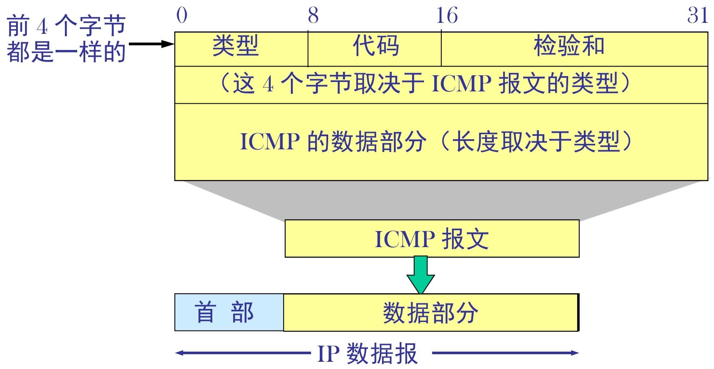

* ICMP报文分两类,即ICMP差错报告报文和ICMP询问报文
* ICMP 报文的前4个字节是统一的格式,共有三个字段:即类型､代码和检验和｡接着的4个字节的内容与ICMP的类型有关

## ARP:地址解析协议

在以太网上广播一个包，询问IP地址，将IP地址映射到数据链路层地址

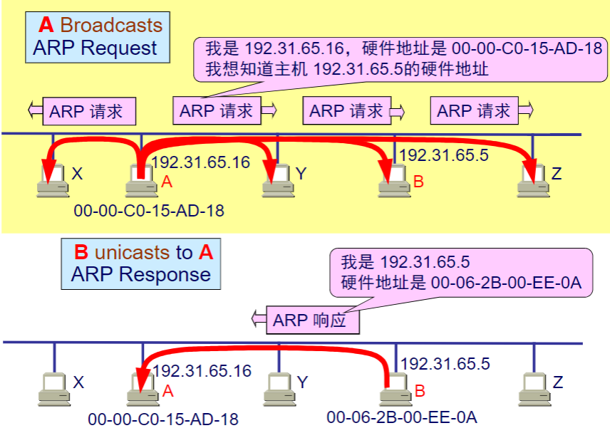

### IP 地址vs. MAC 地址

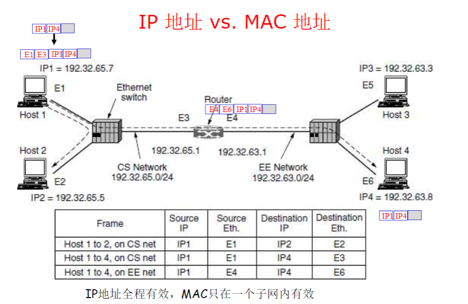

* **IP 地址** ：在整个网络传输过程中始终标识源和目的主机，全程有效
  * 用于跨网络、子网的逻辑寻址 。比如无论数据在哪个子网传输，IP 地址都能明确源和目的主机身份，实现端到端通信 。
* **MAC 地址** ：仅在一个子网内有效，用于子网内设备间数据链路层的物理寻址
  * 像在 CS 子网内，设备间通信靠 MAC 地址识别，一旦跨子网，MAC 地址会根据连接的路由器接口改变 。

## RARP(逆向ARP)

已知设备以太网地址（MAC 地址 ），确定对应 IP 地址

### 工作方式

* RARP 允许工作站在以太网上广播请求。如某工作站 MAC 地址为 14 - 04 - 05 - 18 - 01 - 25 ，它会广播 “我的以太网地址是 14 - 04 - 05 - 18 - 01 - 25 ，谁知道我的 IP 地址是什么？”
* 网络中的 RARP 服务器（或具备相关功能的设备 ）接收此广播请求后，依据其维护的 MAC - IP 地址映射表进行查找，找到对应 IP 地址后，向该工作站发送应答
* 工作站由此获取到自身 IP 地址，从而能正常参与网络通信

## BOOTP(启动协议)

用于配置无盘工作站

无盘工作站自身没有存储设备来保存网络配置信息，BOOTP 可帮助其获取必要的网络参数，实现联网启动和运行 。

* **传输方式** ：与 RARP 不同，BOOTP 基于 UDP 数据报传输 。UDP 是无连接协议，传输效率较高，且 BOOTP 数据报可在路由器上进行转发，这使得它能跨越不同子网为无盘工作站提供服务 。
* **提供网络参数** ：除了帮助获取 IP 地址外，还能提供文件服务器的 IP 地址、默认路由器的 IP 地址以及网络中使用的子网掩码等重要网络配置参数 。这些参数对于无盘工作站正确接入网络、与其他设备通信以及获取所需资源至关重要 。

## DHCP 动态主机配置协议

* DHCP 是一种应用层协议
* **自动配置** ：为远程主机提供自动配置服务 。主机接入网络时，无需人工手动配置复杂的网络参数，通过 DHCP 可快速获取所需信息。
* **配置参数** ：可提供的参数包括主机的 IP 地址、路由器的 IP 地址、子网掩码、DNS 服务器的 IP 地址等 。这些参数是主机正常联网、与其他设备通信以及进行域名解析等操作的基础 。

功能：

* 在 BOOTP 协议基础上扩展而来 。在功能上弥补了 BOOTP 需要人工配置 IP 地址和以太网地址映射表的不足，实现了更自动化、灵活的配置
* 使用客户-服务器模式
  * 客户端（如接入网络的主机 ）向 DHCP 服务器发送配置请求，服务器根据自身配置的地址池等信息，为客户端分配合适的网络参数并返回给客户端，完成配置过程
* 租约和更新

### DHCP: IP地址分配的过程

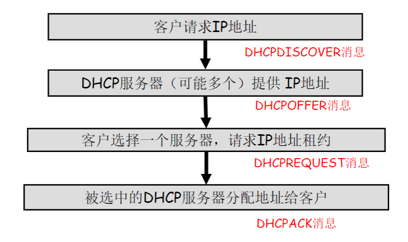

# 选路协议:RIP､OSPF和BGP

## 源主机路由选择

* 源主机先**将自身的子网掩码与目的 IP 地址进行 “与” 操作** 。“与” 操作是按位进行的，只有当两个对应位都为 1 时，结果位才为 1，否则为 0 。通过该操作可得到目的网络地址 。
* 若得到的目的网络地址与源主机所在网络地址相同，说明目的主机在本网内，**源主机直接发送帧给目的主机** 。
* 若目的网络地址与源主机所在网络地址不同，表明目的主机在其他网络，**源主机将帧发送给默认路由器，由路由器负责后续转发** 。

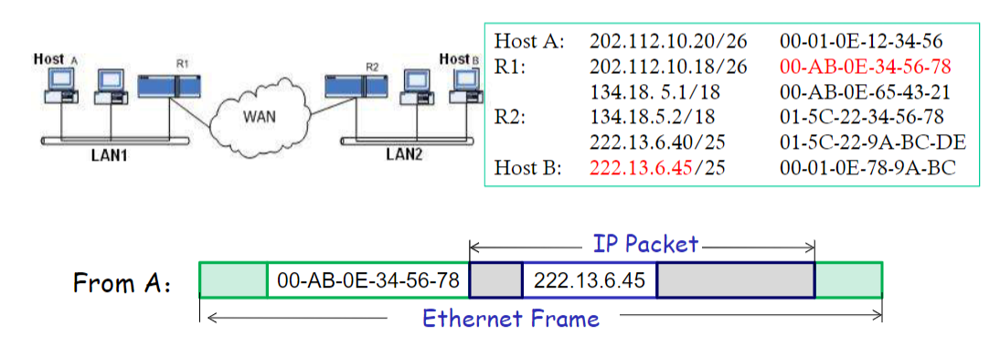

## 路由器路由选择

路由表：目的网络地址、子网掩码、下一跳地址、输出接口

### 步骤

1. 当一个IP包到达,路由器将目的IP地址与子网掩码进行与操作，获得目的网络地址
2. 如果在路由表里发现匹配的表项，该包将被转发到对应的输出接口
3. 如果没有找到匹配表象,该包将转发到默认接口，交给默认路由器

## 网络特定选路与主机特定选路

* 在主机特定选路中，路由表针对每个目的主机设置表项
  * 这种方式能对选路进行更精细、更强的控制，可根据不同主机的需求定制路由策略
* 网络特定选路是将连接到同一网络的所有主机视为一个整体，每个网络只需一个表项来定义网络地址
  * 路由器根据目的网络地址进行转发，无需关注网络内具体主机

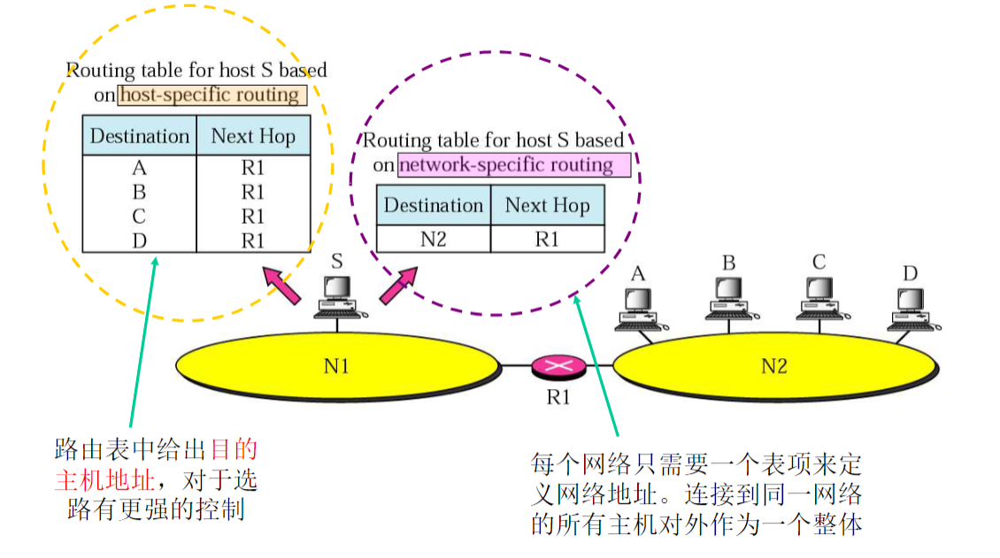

## 默认/缺省路由

当路由表中没有匹配到特定目的网络的表项时，就会启用默认路由

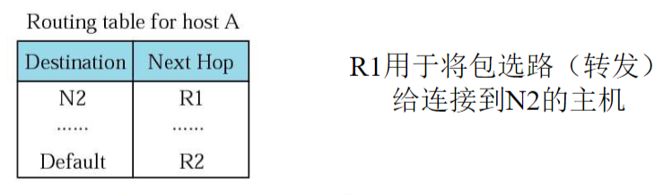

* 默认路由器 R2 的功能是转发那些在本地路由表中无法找到明确转发路径的数据包，将其转发到因特网的其他部分
* 对于默认路由，其目的网络地址用 0.0.0.0 表示
  * 无匹配时会发送到 0.0.0.0 ，即R2路由器

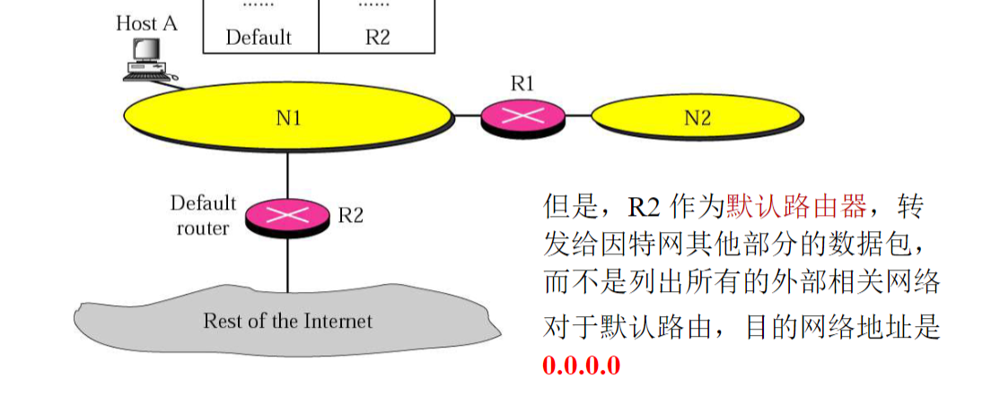

### 路由配置示例

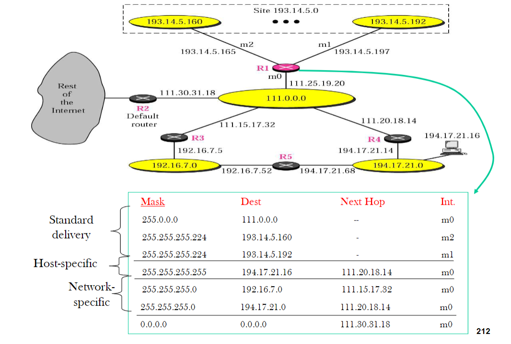

* **Standard delivery（标准传输 ）** ：
  * 对于子网掩码 255.0.0.0 ，目的网络 111.0.0.0 ，无下一跳（“--” ），从 m0 接口转发。表示直接连接在 R1 的 m0 接口上的 111.0.0.0 网络内的数据传输 。
  * 子网掩码 255.255.255.224 ，目的网络 193.14.5.160 和 193.14.5.192 ，分别从 m2 和 m1 接口转发，用于处理 193.14.5.0 子网内特定地址段的数据转发 。
* **Host-specific（主机特定 ）** ：
  * 子网掩码 255.255.255.255 ，目的地址 194.17.21.16 ，下一跳为 111.20.18.14 ，从 m0 接口转发。这是针对特定主机 194.17.21.16 的路由配置 。
* **Network-specific（网络特定 ）** ：
  * 子网掩码 255.255.255.0 ，目的网络 192.16.7.0 ，下一跳为 111.15.17.32 ，从 m0 接口转发，用于 192.16.7.0 网络的数据转发 。
  * 子网掩码 255.255.255.0 ，目的网络 194.17.21.0 ，下一跳为 111.20.18.14 ，从 m0 接口转发，用于 194.17.21.0 网络的数据转发 。
* **默认路由** ：子网掩码 0.0.0.0 ，目的网络 0.0.0.0 ，下一跳为 111.30.31.18 ，从 m0 接口转发。表示当路由表中无其他匹配项时，数据包将通过 R2（默认路由器 ）转发到因特网其他部分 。

## CIDR路由表

* 最长前缀匹配：对于多项匹配,选择子网掩码最长的表项
  * 对于目的地址为 128.125.1.3 的数据包，在路由表中有 / 12 128.96.0.0、/17 128.125.0.0 等多个匹配项，根据最长前缀匹配原则，会选择 / 17 128.125.0.0 对应的表项来转发数据包。
* 对于路由表中的每个表项
  * **按位与运算** ：对于路由表中的每个表项，将表项中的子网掩码（EntryMask ）与 IP 数据报的目的地址（IPDatagramDestinationAddress ）进行按位与（bitAND ）运算，得到 MaskedAddress 。按位与运算规则是：只有当两个二进制位都为 1 时，结果位才为 1，否则为 0 。
  * **匹配判断** ：将得到的 MaskedAddress 与表项中的目的地址（EntryDestination ）进行比较。如果两者相等，就标记该表项，说明此表项与目的 IP 地址匹配 。当有多个表项都匹配时，再依据最长前缀匹配原则确定最终使用的表项 。

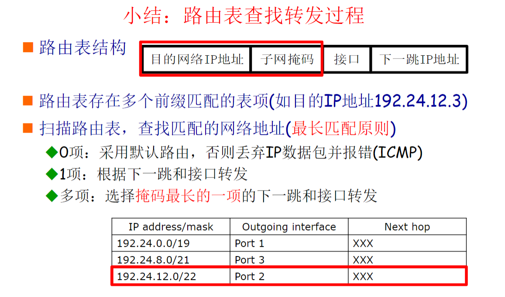

# 因特网中的路由结构

* 自治系统（AS）

  * 因特网被划分成许多自治系统（AS ），每个自治系统由一个或多个机构独立管理
* 内部选路协议

  * 在每个自治系统内部，管理机构可以根据自身需求选择使用特定的选路协议，即内部选路协议
  * 常见的内部选路协议有 RIP（路由信息协议）、OSPF（开放最短路径优先）等 。这些协议用于在自治系统内部的路由器之间交换路由信息，计算最佳路径，实现数据包在本自治系统内的高效转发 。
* 外部选路协议

  * 当数据包需要在不同自治系统之间传输时，就需要使用统一的外部选路协议
  * 目前因特网中广泛使用的外部选路协议是 BGP（边界网关协议） 。BGP 用于在不同自治系统的边界路由器之间交换路由信息，确定自治系统间的最佳路径，使得数据包能够跨越不同的自治系统，在整个因特网中进行传输 。

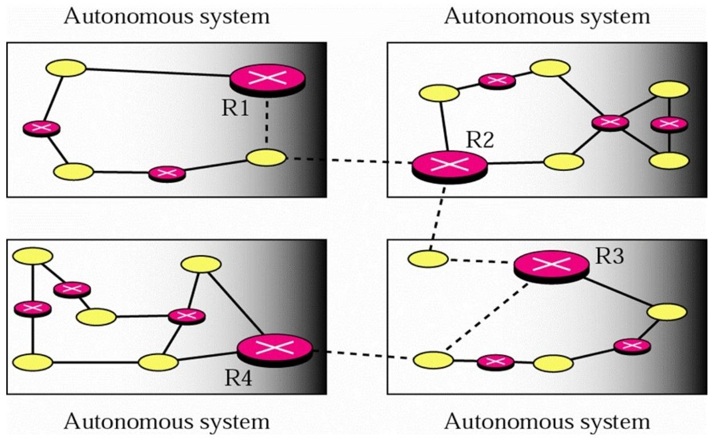

## 因特网中流行的选路协议

* RIP: 基于距离矢量选路
* OSPF: 基于链路状态选路
* BGP: 修改的距离矢量——路径矢量选路

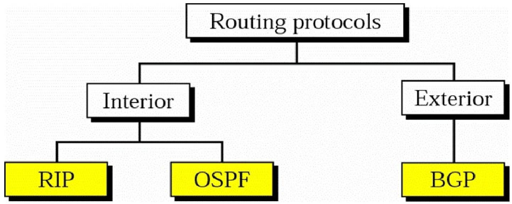

### RIP

* 路由信息协议
* 距离矢量选路的实现协议
* 路径开销基于跳数
  * RIP将所有网络看作平等的,穿过一个网络的开销是 一样的:每个网络一跳
* 跳数的上限是16, 可扩展性差
* RIP消息在UDP 数据报中传输
* RIPv1 不包含子网掩码
* RIPv2 支持子网掩码和下一跳地址

### OPSF

* 开放的最短路径优先
* 基于链路状态选路
* 每个路由器在任何时候都应该有网络的确切完整拓扑
* 每个路由器需要向区内所有其他路由器通告自己的邻接情况
* OSPF消息直接在IP 包中传输

#### OSPF: 区(Areas)

* OSPF将AS(自治系统) 划分为多个区——包含路由器､ 主机､网络
* 骨干路由器､AS边界路由器､区边界路由器和内部 路由器

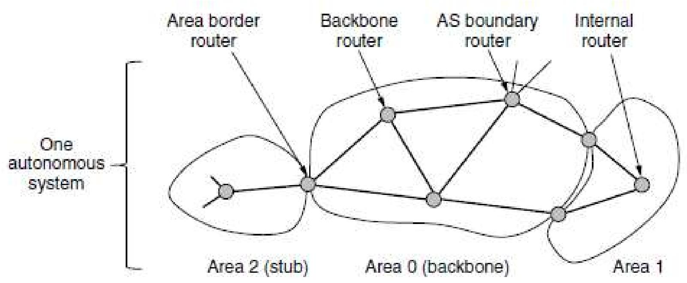

#### OSPF: 链路类型

### BGP

* 边界网关协议
* 路径矢量选路
* 距离矢量算法+额外的信息

# IP组播

组播/多播:将信息以高效的方式发给一组目的地的网络技术

组播能有针对性地将数据发送给特定的一组接收者

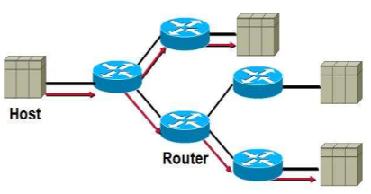

在组播中，消息在网络的每条链路上只发送一次，仅当发往多个目的地的链路出现分离时才需要复制

### 组地址

* **地址类型** ：IP 组播使用 D 类地址作为组地址 。D 类地址的特点是最高 4 位固定为 1110 。
* **地址范围** ：其地址范围是 224.0.0.0 到 239.255.255.255 ，共 28 位可分配 。如此大的地址空间，可以支持超过 2.5 亿个组 ，能够满足各种规模网络中不同组播应用的需求

IP 组播提供尽力而为服务

## IGMP

IGMP 即因特网组管理协议，主要用于管理一个网络内特定多播组里主机的成员列表

* 通过 IGMP，主机可以向路由器表明自己加入或离开某个多播组的意愿
* 路由器则可以了解网络中哪些主机属于哪些多播组
* 在主机加入一个多播组时,发送IGMP报告消息给 路由器
* 多播路由器周期性向多播地址224.0.0.1发送IGMP 询问,要求网内的各主机报告他们加入的小组信息
* 每个主机发回IGMP报告,告知其所使用的组地址

IGMP 的相关标准定义在 RFC 3376 中，RFC（Request for Comments）是因特网标准的官方文档

IGMP 消息封装在 IP 包中 ，借助 IP 协议进行传输

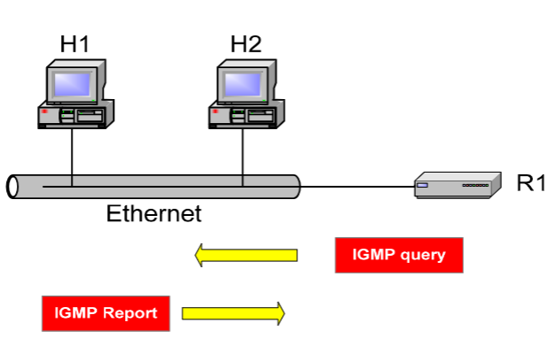

# 移动IP

### 移动节点（MN）

移动节点（Mobile Node, MN）指从原本网络移动到其他网络（外地网络）的主机

### 本地 / 归属 / 家乡代理（HA）

本地 / 归属 / 家乡代理（Home Agent, HA）是移动节点归属网络上的路由器 

归属网络就是移动节点最初所在的网络

HA 负责维护移动节点的相关信息，当移动节点移动到外地网络后，HA 可以接收发往移动节点原归属地 IP 地址的数据包，并通过一定机制将这些数据包转发给移动节点

### 关照地址（CA）

关照地址（Care - of Address, CA）是外地代理的 IP 地址 。

当移动节点在外地网络注册后，外地代理会将这个地址发送给归属代理 。

CA 的作用是让归属代理知道移动节点在外地网络的 “落脚点”，以便归属代理能够将数据包通过隧道等技术转发到外地代理，再由外地代理交付给移动节点

### 相关节点

相关节点是指与移动节点进行通信的主机

### 目标

需要通过 HA、FA、CA 等的协同工作，利用诸如 IP 隧道等技术，对数据包进行转发和处理，实现移动节点在不同网络间的无缝通信

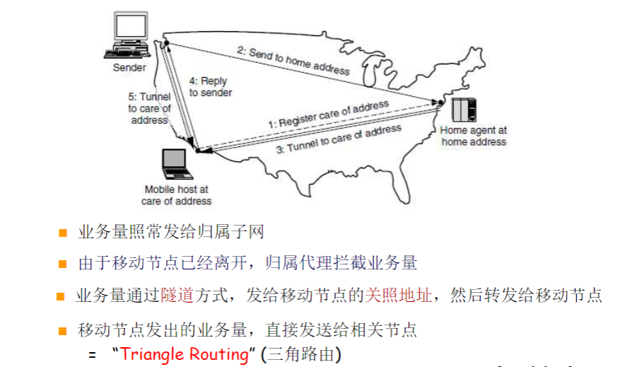

# 总结

| 分类         | 要点                                 | 简介                                                                                                                                                                                         |
| ------------ | ------------------------------------ | -------------------------------------------------------------------------------------------------------------------------------------------------------------------------------------------- |
| 网络层概述   | 物理层的位置和功能                   | 物理层处于网络体系结构最底层，负责处理物理介质上的信号传输，如电缆、光纤等介质中比特流的传输，包括信号的编码、调制解调等功能                                                                 |
|              | 虚电路交换 vs. 数据包选路            | 虚电路交换先建立一条逻辑连接，数据沿该连接按序传输；数据包选路则每个数据包独立寻址，路径可能不同，二者在连接建立、传输可靠性等方面存在差异                                                   |
| 选路算法     | 静态选路 vs. 动态选路                | 静态选路由管理员手动配置路由信息，不随网络变化自动调整；动态选路能根据网络拓扑和流量变化自动更新路由表，适应网络动态变化                                                                     |
|              | 汇集树：衡量选路算法的标杆           | 汇集树是一种理想的路由结构，用于衡量选路算法优劣，算法越接近汇集树结构，理论上路由效率越高                                                                                                   |
|              | 洪泛/泛洪                            | 洪泛是一种简单的路由策略，节点将收到的数据包向除接收端口外的所有端口转发，可用于快速传播信息，但可能导致网络拥塞                                                                             |
|              | Dijkstra算法                         | 一种链路状态路由算法，以源节点为根，逐步计算到其他节点的最短路径，常用于构建路由表，具有较高准确性                                                                                           |
|              | 距离矢量选路DVR                      | 基于距离矢量，路由器根据跳数等度量值与相邻路由器交换路由信息，构建和更新路由表，实现简单但可能存在慢收敛等问题                                                                               |
|              | 链路状态选路LSR                      | 路由器先收集网络链路状态信息，构建链路状态数据库，再用算法计算最短路径，能更准确反映网络拓扑，收敛速度较快                                                                                   |
|              | 层次选路：思路                       | 将网络划分为不同层次，如自治系统内和自治系统间，不同层次采用不同路由策略，可减少路由复杂度，提高可扩展性                                                                                     |
| 拥塞控制     | 虚电路网络：接纳控制                 | 在虚电路建立阶段，通过评估网络资源（如带宽、缓存等）是否满足需求，决定是否接纳新连接，防止网络过载                                                                                           |
|              | 数据报网络：发现拥塞、通知、发送降速 | 通过检测网络流量、延迟等指标发现拥塞；采用抑制分组、ECN（显式拥塞通知）等方式通知发送方；发送方接收到通知后降低发送速率，缓解拥塞                                                            |
|              | 抑制分组、ECN、RED                   | 抑制分组是向源节点发送控制分组要求降速；ECN利用IP包头字段标记拥塞，通知发送方；RED（随机早期检测）通过监测队列长度，随机丢弃数据包来预防拥塞                                                 |
| QoS          | 令牌桶、分组调度                     | 令牌桶用于控制流量速率，以固定速率生成令牌，数据包需获取令牌才能发送；分组调度决定数据包发送顺序，保障不同业务服务质量                                                                       |
| IP编制       | 分类地址：A、B、C类                  | 早期IP地址分类方式，A类用于大型网络，B类适用于中等规模，C类用于小型网络，通过地址前缀区分                                                                                                    |
|              | 层次地址：网络号+主机号              | IP地址由网络号和主机号组成，网络号标识网络，主机号标识网络内主机，便于网络管理和路由选择                                                                                                     |
|              | 选路使用网络地址                     | 路由选择过程中依据IP地址的网络号部分，确定数据包转发路径                                                                                                                                     |
|              | 子网概念                             | 将一个网络划分为多个子网，通过子网掩码区分，可提高IP地址利用率，便于网络管理                                                                                                                 |
|              | CIDR: 前缀表示法                     | 无类别域间选路，用前缀长度表示子网掩码，可灵活分配地址块，实现路由聚合，减少路由表条目                                                                                                       |
|              | 子网掩码相关计算                     | 通过子网掩码与IP地址按位与运算，可得到网络地址；子网掩码还用于判断主机是否在同一子网等计算                                                                                                   |
| IP包格式     | 包头字段的功能                       | IP包头包含版本、首部长度、服务类型、总长度、标识、标志、片偏移、生存时间、协议、首部校验和、源IP地址、目的IP地址等字段，各字段承担不同功能，如标识数据包、控制传输路径等                     |
|              | 校验和概念                           | 通过对IP包头数据计算校验和，用于检测包头在传输过程中是否发生错误，接收方通过校验和验证数据完整性                                                                                             |
|              | 分段/重装                            | 当数据包大小超过链路最大传输单元时，需进行分段，将大的数据包分成多个小的片段；在接收端再进行重装，恢复原始数据包                                                                             |
| 选路协议     | RIP, OSPF和BGP：特点和应用           | RIP基于距离矢量，以跳数为度量，简单但扩展性差，适用于小型网络；OSPF基于链路状态，能准确反映网络拓扑，适用于大型网络内部；BGP用于自治系统间，基于路径矢量，支持策略选路，保障不同自治系统互联 |
| 其他相关协议 | IPv6：特点、地址、包头与IPv4的异同   | IPv6具有更大地址空间、更好的安全性和扩展性等特点；地址表示和数量与IPv4不同；包头结构和字段功能有差异，旨在解决IPv4地址耗尽等问题                                                             |
|              | ICMP：差错报告和测试                 | 用于在IP网络中传递差错和控制信息，如网络不可达、超时等差错报告，以及ping命令用于测试网络连通性                                                                                               |
|              | ARP: IP address → MAC address       | 地址解析协议，用于将IP地址解析为对应的MAC地址，实现网络层到数据链路层的映射，以便在局域网中进行数据传输                                                                                      |
|              | DHCP：自动分配IP地址                 | 动态主机配置协议，可自动为网络中的主机分配IP地址、子网掩码、默认网关等网络参数，简化网络配置管理                                                                                             |
|              | IGMP：功能——管理组成员             | 因特网组管理协议，用于管理主机与路由器间的组播组成员关系，主机通过该协议告知路由器其加入或离开组播组的情况                                                                                   |
|              | 移动IP：了解概念和思路               | 使移动设备在不同网络间移动时，仍能保持原有IP地址通信，通过归属代理、外地代理等机制，实现数据包的转发和路由                                                                                   |
