今天下午啵煮打开项目目录，一看发现天塌了，不是我vscode呢？：

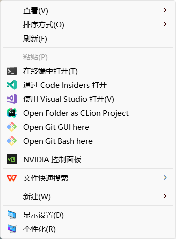

这多出来的NVIDIA和WPS是什么鬼？Windows系统又犯什么病？

检查windows更新直接给我看笑了：

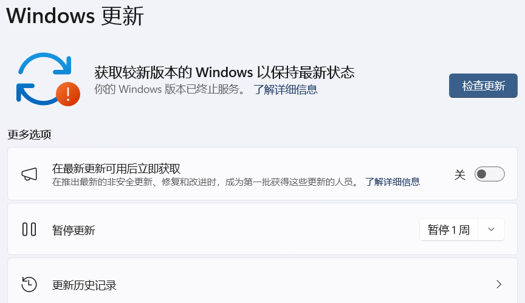

这b系统怎么都检测不出来更新，下了安装软件说什么系统要挂梯子才能下载，我勒个局域网上不了windows

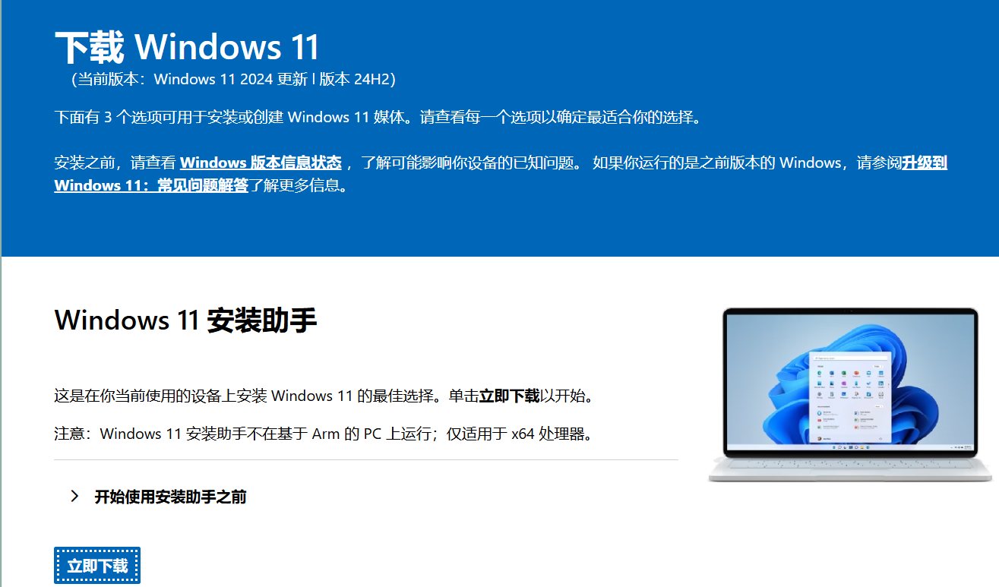

啵煮直接一怒之下怒了一下~~~

事情还是要解决的，最后也只能靠Gemini了：

# 修改注册表


Windows 默认的右键菜单是根据文件类型（通过文件扩展名判断）来显示不同的“打开方式”选项的。对于文件夹（它没有扩展名），默认的“打开方式”选项非常有限，通常只有“打开”、“在新窗口中打开”等。

为了让文件夹也能像文件一样，通过右键菜单直接用特定程序打开，我们需要手动在注册表中为文件夹的右键菜单添加自定义的命令。


## **第一步：打开注册表编辑器**

1. 按下 **Win + R** 键，打开“运行”对话框。
2. 输入 `regedit`，然后按回车。
3. 如果出现用户账户控制（UAC）提示，请点击“是”以允许程序运行。

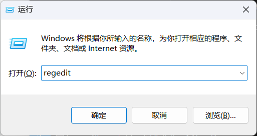

到达一个神奇的地方：

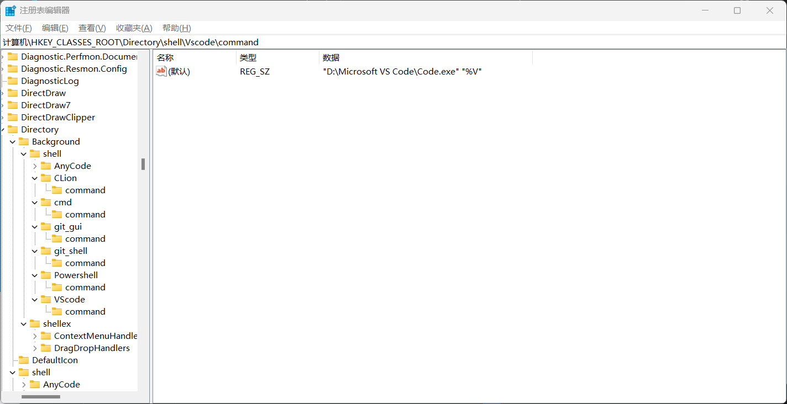


#### **第二步：定位到目标路径**

在注册表编辑器左侧的目录树中，依次展开以下路径：

```
HKEY_CLASSES_ROOT\Directory\shell
```

这里的 `Directory` 键是用来控制所有文件夹右键菜单的。

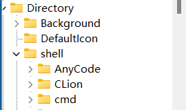

这byd Gemini一开始要我跟着它做，结果p用没有，最后对比着问了才知道各个项的功能不一样：


* **`HKEY_CLASSES_ROOT\Directory\Background\shell`**
  * 这个键控制的是 **在文件夹的空白处** 点击右键时出现的菜单。许多程序（例如 Git Bash Here）为了方便，会选择注册在这里。
* **`HKEY_CLASSES_ROOT\Folder\shell`**
  * 这个键控制的是 **所有“文件夹”类型对象** 的右键菜单。它与 `Directory\shell` 类似，但有时会被某些程序优先使用。我们之前也提到了这个路径。
* **`HKEY_LOCAL_MACHINE\SOFTWARE\Classes\Directory\shell`**
  * 这个键与 `HKEY_CLASSES_ROOT` 类似，但它属于 **系统级别** 的配置。安装程序通常会在这里写入配置，以确保对所有用户都生效。
* **`HKEY_CLASSES_ROOT\Directory\shell\Find.exe`** （以及类似的键）
  * **这是最关键的一点。** 你在 `Directory\shell` 下看到的一些键，比如 `Find` 或 `git_gui`，它们并不是真正的“文件夹”，而是  **系统内置的命令** 。这些命令在你的右键菜单中显示为文本，并且在内部调用了对应的程序。
  * **`通过 Code Insiders 打开`** 很可能就是一个独立的注册表项，它位于更深的子键下，或者使用了不同的注册表类型，所以你在 `Directory\shell` 下面直接看不到一个名为 `Code Insiders` 的文件夹。


#### **第三步：创建新的菜单项**

1. 在 `shell` 键上点击右键，选择  **新建 > 项** 。
2. 将新创建的项重命名为你希望在右键菜单中显示的文本，例如 `用VSCode打开`。
   * **思考：** 这个名称可以任意起，但最好简洁明了，能一眼看出是做什么用的。你也可以使用中文，但为了避免潜在的编码问题，一些用户倾向于使用英文或拼音。


#### **第四步：创建执行命令**

1. 选中刚才创建的 `用VSCode打开` 项。
2. 在其下方再次点击右键，选择  **新建 > 项** 。
3. 将新创建的项命名为 `command`。
   * **提示：** `command` 这个名称是固定的，表示这个菜单项所要执行的命令。
4. 选中 `command` 项，然后在右侧找到名为 `(默认)` 的字符串值。
5. 双击 `(默认)`，在弹出的“编辑字符串”窗口中，将数值数据修改为程序的执行路径和参数。
   * **数值数据格式：** `"程序路径" "%1"`
   * **`"程序路径"`** ：你需要找到你想要使用的程序的 `.exe` 文件路径。例如，VS Code 的路径通常是 `"C:\Users\YourUserName\AppData\Local\Programs\Microsoft VS Code\Code.exe"`。
   * **注意：** 如果路径中包含空格，必须用双引号 `"` 包围起来。
   * **`%1`** ：这是一个占位符，代表你右键点击的文件夹路径。当你在文件夹上点击这个菜单项时，Windows 会自动将该文件夹的完整路径替换到 `%1` 的位置，并作为参数传递给程序。
     以 VS Code 为例，最终的数值数据可能如下所示：

```
"D:\Microsoft VS Code\Code.exe" "%1"
```

请将 `YourUserName` 替换为你自己的 Windows 用户名。

应用安装路径详见**附录**

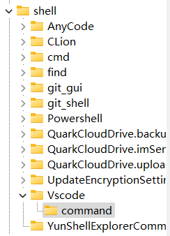

如果是在外面

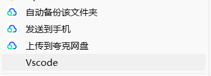

这样你就可以获得右键文件之后展开的情况

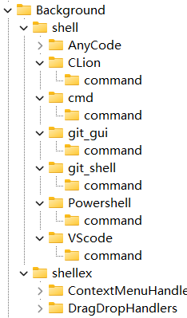

而如果是在background：

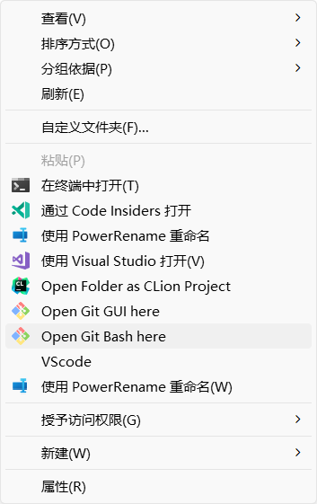

就可以做到右键空白打开

## **第五步：添加Icon**


1. 在 `OpenWithCode` 键的右侧空白处，点击右键，选择  **新建 > 字符串值** 。
1. 将新创建的字符串值命名为 `Icon`。
1. 双击 `Icon` 值，在弹出的“编辑字符串”窗口中，将**数值数据**设置为你从第一步复制到的路径。
   * **注意：** 在这里，路径通常不需要双引号。所以，如果你复制到的路径是 `"D:\Microsoft VS Code\Code.exe"`，那么在这里你只需要填入 `D:\Microsoft VS Code\Code.exe`。
1. 如果你想使用 VS Code `Code.exe` 文件中的特定图标（通常默认就是第一个），你也可以加上索引，例如：
   ```
   D:\Microsoft VS Code\Code.exe,0
   ```

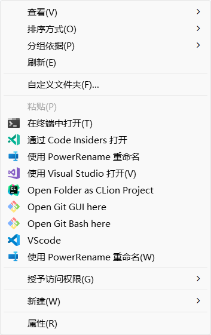

这样就彻底完成了

## 另外的问题-命令参数%

很奇怪的现象，在background中设置的“%1”会导致Vscode无法使用，但是在外部的就可以：


### **对 `%V` 的深入理解**

在 Windows 的注册表命令中，占位符（如 `%1`, `%V`, `%L` 等）用于传递不同的信息给执行的程序。

* **`%1`** ：通常代表当前选定的文件的完整路径。
* **`%V`** ：通常代表当前选定的文件夹的完整路径。在某些 Shell 上下文中，尤其是在文件和文件夹混合的右键菜单中，`%V` 能够更明确地指示要操作的是一个文件夹。
* **`%L`** ：代表文件名。

情况很可能是在 Windows 11 或某些特定的注册表配置下，系统对这两种占位符的解析逻辑有所不同。`%1` 可能被某些程序或系统组件误解为文件路径，导致命令执行失败，而 `%V` 则能正确地将文件夹路径传递给 VS Code。

# 附录

## 查找应用安装路径

1. 在 Windows **开始菜单**中，搜索并找到 **“Visual Studio Code”** 程序。
   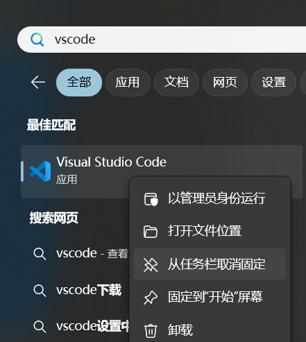
2. 在搜索结果上  **点击右键** ，选择  **“打开文件位置”** 。
3. 这通常会带你到一个快捷方式所在的文件夹。再次对这个快捷方式  **点击右键** ，选择  **“属性”** 。
   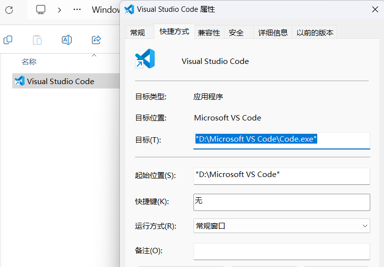
4. 在“属性”窗口的 **“快捷方式”** 标签页下，**“目标”** 字段中显示的路径就是 VS Code 的可执行文件（`Code.exe`）的完整路径。
